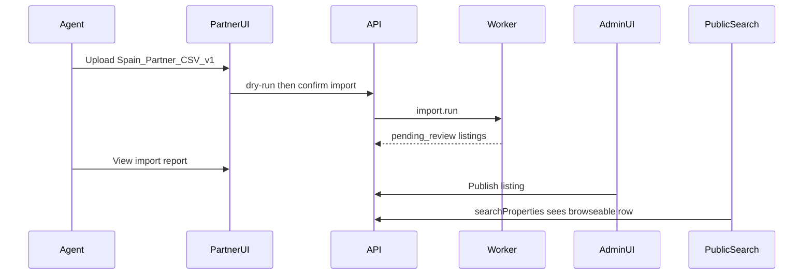

# Agency and admin portal design — Phase 3

Date: 2026-08-05  
Status: Planning  
Related: [`PHASE3_PLAN.md`](PHASE3_PLAN.md), [`PHASE3_SECURITY_REVIEW.md`](PHASE3_SECURITY_REVIEW.md)

## Placement

Partner and admin UIs live inside `apps/web` under locale shells (same i18n/RTL stack as Phase 2):

- `/{locale}/partner/...` — agency inventory
- `/{locale}/admin/...` — platform operations

No separate deployable app in Phase 3. Visual language continues Mediterranean tokens from `@spain/ui` (not purple-default AI chrome).

## Roles

| Role               | Portal  | Capabilities                                                            |
| ------------------ | ------- | ----------------------------------------------------------------------- |
| `org_agent`        | Partner | View org listings, upload CSV, view import errors, declare media rights |
| `org_owner`        | Partner | Agent + manage org members (basic), view audit of own org               |
| `listing_reviewer` | Admin   | Review queue, publish/withdraw, resolve duplicates, view imports        |
| `platform_admin`   | Admin   | Reviewer + source registry, permission changes, all orgs                |

Buyers continue to use public search/detail/favourites; they do not see partner/admin nav.

## Information architecture

### Partner

| Route                    | Purpose                                                  |
| ------------------------ | -------------------------------------------------------- |
| `/partner`               | Dashboard: listing counts, last import, freshness alerts |
| `/partner/listings`      | Inventory table (status, price, freshness, external id)  |
| `/partner/listings/[id]` | Edit metadata (limited), media rights, history           |
| `/partner/imports`       | Import run list                                          |
| `/partner/imports/new`   | CSV upload + dry-run preview + confirm                   |
| `/partner/imports/[id]`  | Report, errors, quarantine download                      |
| `/partner/media`         | Rights declarations / upload status                      |

### Admin

| Route                  | Purpose                                                           |
| ---------------------- | ----------------------------------------------------------------- |
| `/admin`               | Ops dashboard: pending reviews, failed feeds, permission expiries |
| `/admin/sources`       | Source registry                                                   |
| `/admin/sources/[id]`  | Permission, feed config, health                                   |
| `/admin/review`        | Listings in `pending_review`                                      |
| `/admin/listings/[id]` | Publish / withdraw / freshness override                           |
| `/admin/duplicates`    | Candidate queue                                                   |
| `/admin/imports`       | Cross-org import monitor                                          |
| `/admin/audit`         | Audit log search                                                  |

## Primary flows

### A. Agency CSV vertical slice

### B. Admin publish

1. Open review queue.
2. Verify source attribution, geo confidence, media rights, freshness labels.
3. Publish → `is_public_browseable=true`, status `published`/`available`, audit event.
4. Or request changes / withdraw.

### C. Freshness miss

1. Successful full sync completes.
2. Missing external ids → `temporarily_unverified`.
3. Agency dashboard shows alert; admin may withdraw after threshold.

## UI requirements

- Clear **source** and **freshness** labels on every inventory row (never imply legacy snapshots are this partner’s live stock).
- Empty and error states for imports.
- Shareable admin deep links by listing id.
- Keyboard accessible tables; axe on primary partner upload and admin review screens.
- Dark/light: follow Phase 2 token system; apply `.dark` via system preference or toggle when wiring (carry Phase 2 acceptance gap if still open).

## API surface (partner/admin)

| Method    | Path                                    | Actor      |
| --------- | --------------------------------------- | ---------- |
| GET/POST  | `/api/v1/partner/imports`               | org member |
| GET       | `/api/v1/partner/imports/{id}`          | org member |
| GET       | `/api/v1/partner/listings`              | org member |
| PATCH     | `/api/v1/partner/listings/{id}`         | org member |
| POST      | `/api/v1/partner/media/uploads`         | org member |
| GET/PATCH | `/api/v1/admin/sources`                 | platform   |
| POST      | `/api/v1/admin/listings/{id}/publish`   | reviewer   |
| POST      | `/api/v1/admin/listings/{id}/withdraw`  | reviewer   |
| GET/POST  | `/api/v1/admin/duplicates/{id}/resolve` | reviewer   |
| GET       | `/api/v1/admin/audit`                   | platform   |

Public `/api/v1/properties*` remains buyer-facing and must not expose draft/pending_review rows.

## Auth wiring

- Local/CI: FakeAuth + seeded memberships.
- Production: Supabase Auth session; replace temporary `x-user-id` header with verified session before partner/admin launch (see security review).

## Out of scope UI

- Scraping configuration screens
- Multi-brand white-label agency themes
- Full CRM lead inbox (Phase 4 buyer/leads)
- Map drawing tools

## Acceptance

- [ ] Partner completes CSV upload → report without seeing other orgs.
- [ ] Admin publishes → listing appears on public search with source/freshness.
- [ ] Unauthorized role receives 403 on admin routes.
- [ ] Playwright covers partner → admin → public path; axe critical=0 on primary screens.
