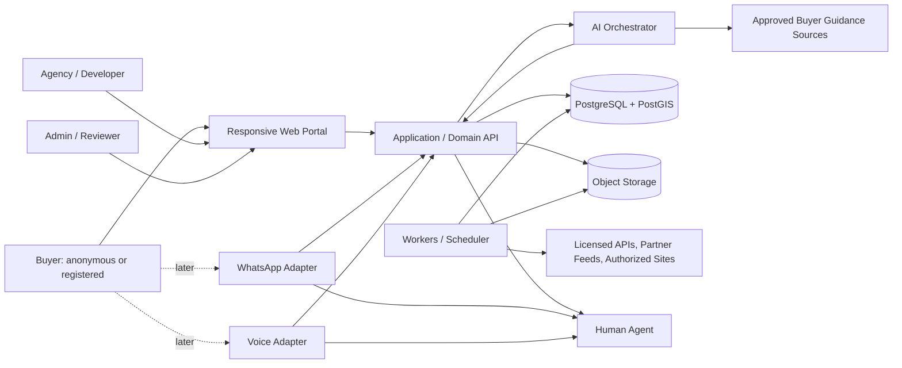
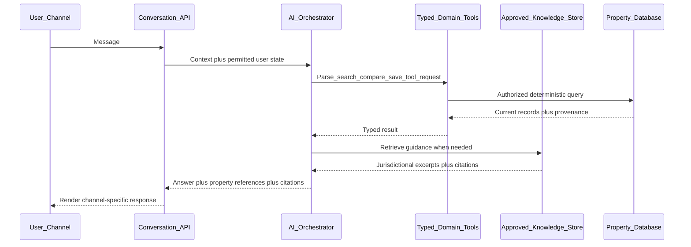
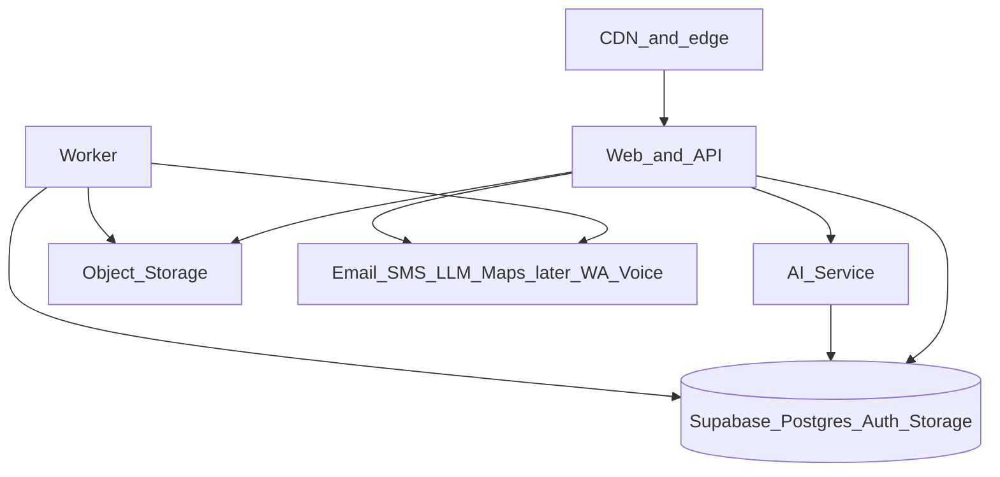
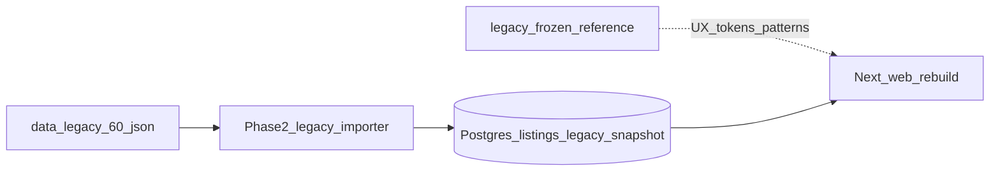

# Spain Property Buyer Portal — Architecture

Version: 1.2  
Status: Phase 1.1 production architecture locked  
Authoritative source: [`spain_property_portal_build_plan_and_master_prompt_v2.md`](spain_property_portal_build_plan_and_master_prompt_v2.md)  
Companion: [`IMPLEMENTATION_PLAN.md`](IMPLEMENTATION_PLAN.md), [`DATABASE_DESIGN.md`](DATABASE_DESIGN.md), [`LEGACY_CODE_ASSESSMENT.md`](LEGACY_CODE_ASSESSMENT.md)

---

## 1. Architecture principles

1. Build a **modular monolith** first, not a premature microservice estate.
2. Keep domain boundaries clear so ingestion, AI and communication workers can scale independently later.
3. Use one canonical property database and one **channel-neutral** conversation model.
4. Separate a **physical property** from its **commercial listings**.
5. Store provenance, rights and freshness as first-class data.
6. Use typed interfaces for all external providers.
7. Protect user and partner data with database-level authorization (RLS).
8. Implement production paths as **vertical slices**, not disconnected screens.
9. Prefer deterministic rules and geospatial calculations over AI guesses.
10. Do not activate a channel until operational support, consent and monitoring exist.
11. Treat [`legacy/`](../legacy/) as a **frozen UX/data reference** — rebuild the production UI on Next.js; do not adopt the Vite/Express/SQLite stack.
12. Production identity, database, and authorized media use Supabase Auth, Supabase PostgreSQL, and Supabase Storage respectively. Drizzle owns schema migrations and typed application queries.
13. Fake auth and local storage providers are non-persistent development/test implementations and are rejected in production.
14. **Phase 3.1 (planned):** browser identity for buyers, agencies, and admins is a **server-verified AuthProvider session**. Client headers such as `x-user-id` are not production authority. See [`PHASE3_1_AUTH_PLAN.md`](PHASE3_1_AUTH_PLAN.md) and ADR-029 in [`DECISIONS.md`](DECISIONS.md).

### 1.1 Phase 1.1 provider boundaries

- `AuthProvider` is the sole authentication boundary. `SupabaseAuthProvider` supplies persistent Supabase user UUIDs; `FakeAuthProvider` owns its process-local OTP/user maps internally.
- UI and domain code never access an in-memory user map. Future favourites, shortlists, and conversations receive the provider-issued persistent user ID.
- `StorageProvider` isolates authorized-media storage. `SupabaseStorageProvider` is the production server adapter; `LocalStorageProvider` is local/test only.
- Provider SDKs remain adapters and do not own guest merge, consent, workspace, or media-rights rules.
- Production configuration fails closed before serving when auth is fake/missing or Supabase Auth configuration is incomplete.
- **Phase 3.1 extends this:** OTP verify must establish an HttpOnly session cookie; partner/admin/favourites routes call `getSession` rather than trusting `x-user-id`. Request-scoped DB access sets `request.jwt.claim.sub` so RLS matches the session user.

---

## 2. Context diagram



---

## 3. Container view

| Container            | Responsibility                                                           | Tech default                                             |
| -------------------- | ------------------------------------------------------------------------ | -------------------------------------------------------- |
| `apps/web`           | Public portal, account workspace, admin, partner UI, website chat        | Next.js App Router, React, TypeScript, Tailwind          |
| `apps/api`           | Domain API/BFF when not fully hosted in Next route handlers              | TypeScript, Zod contracts, versioned `/api/v1`           |
| `apps/ai-service`    | Orchestration, RAG over approved sources, tool calling, evaluations      | TypeScript + OpenAPI                                     |
| `apps/worker`        | Ingestion, media processing, enrichment, alerts, freshness, privacy jobs | Same monorepo TS; one job framework                      |
| PostgreSQL + PostGIS | Canonical data, FTS, geospatial, pgvector knowledge                      | Supabase-managed                                         |
| Object storage       | Rights-cleared media variants                                            | Supabase Storage + CDN                                   |
| Channel adapters     | Email, SMS, WhatsApp, STT, TTS, telephony                                | `packages/communications` interfaces + provider adapters |

Provider SDKs must not own domain logic. Adapters translate provider payloads into internal events and map internal `Message` records to channel-specific formats.

### 3.1 Database deployment

Committed Drizzle migrations in `packages/database/drizzle` are the only production schema deployment path. `db:generate` creates reviewable SQL, `db:migrate` applies the migration journal, and `db:seed` adds idempotent reference data. `drizzle-kit push` is not a production strategy.

---

## 4. Monorepo package map

```text
apps/
  web/
  api/
  ai-service/
  worker/
packages/
  database/         # Drizzle schema, migrations, RLS, seeds
  domain/           # entities, policies, scoring, status machines
  search/           # PropertySearchCriteria + deterministic query builder
  ingestion/        # source contracts, normalize, dedupe, freshness
  communications/   # email/SMS/WhatsApp/voice interfaces + fakes
  ai-tools/         # typed tool schemas shared by AI and API
  ui/               # accessible design system
  i18n/             # en, es, ca, ar + RTL helpers
  observability/    # logging, traces, metrics helpers
  config/           # env validation, shared TS/lint configs
data/
  legacy/
  fixtures/
legacy/                 # FROZEN reference SPA (do not modify)
docs/
```

---

## 5. Bounded contexts

### Identity and consent

Users, guest sessions, verified email/mobile identities, channel identities, sessions, roles, communication preferences, consent, privacy exports and deletion.

### Geography

Spain hierarchy (country → autonomous community → province → comarca/island → municipality → district → neighborhood/locality → postal code → development/building/unit), aliases, coordinates, polygons, geocoding confidence, transport/amenity links, environmental layers.

### Inventory

Physical properties, developments, units, commercial listings, features, documents, media, prices, availability, provenance and verification.

### Search and ranking

Typed filters, geospatial queries, text search, saved searches, explainable preference weighting, result analytics and KPI summaries.

### Buyer workspace

Favourites, named shortlists, comparison sets, notes, collaborators, history and purchase stages.

### Leads and viewings

Enquiries, viewing requests, assignments, messages, partner responses, statuses and service-level metrics.

### Conversations and channels

Channel-neutral threads, messages, participants, channel identities, AI runs, summaries, handoffs and notification delivery.

### Ingestion and data quality

Sources, permissions, feed configurations, jobs, raw snapshots, extracted values, normalization, media rights, duplicate candidates, freshness and audits.

### Knowledge and calculators

Approved documents, jurisdiction metadata, review dates, chunks, citations, regional tax/cost rules and document-readiness templates.

---

## 6. Frontend architecture

### 6.1 Surfaces in `apps/web`

| Surface           | Audience                      | Capabilities                                                                                                                                                                  |
| ----------------- | ----------------------------- | ----------------------------------------------------------------------------------------------------------------------------------------------------------------------------- |
| Public portal     | Anonymous + registered buyers | Search (card/list/table/map), detail, temporary favourites/compare, rate-limited AI chat, share links, start enquiry                                                          |
| Account workspace | Registered buyers             | Profile, preferences, favourites, shortlists, comparisons, saved searches, alerts, history, enquiries, privacy controls                                                       |
| Partner portal    | Agencies/developers           | Org verification, staff roles, listings, developments/units, media, feeds, import errors, duplicates, leads, response metrics, rights declarations                            |
| Admin portal      | Internal staff                | Review queues, stale/duplicates, feed health, source licences, fraud reports, legal knowledge, calculator rules, consent/templates, privacy requests, AI feedback, audit logs |

### 6.2 UX constraints

- Locales: `en`, `es`, `ca`, `ar` with proper RTL for Arabic
- Canonical source-language listing text stored separately from translations; label machine translations; never overwrite originals
- WCAG 2.2 AA: keyboard access, semantic controls, focus management, contrast, reduced motion, accessible tables, map alternatives, live-region announcements for changing results; **allow pinch-zoom** (do not inherit legacy `maximum-scale=1`)
- Stable shareable URLs for search state (do not use legacy hash-router filter state)
- Dark/light support inspired by the legacy Mediterranean token set (teal / sand / terracotta; General Sans, Fraunces, JetBrains Mono) without treating the Vite SPA as source
- Preserve legacy behaviours as patterns: sticky header, filter sidebar / mobile details, cards vs compare table, KPI strip — rebuild in App Router components

### 6.3 Map

MapLibre GL JS with licensed tile and geocoding providers. Clustering, list synchronization, draw-a-polygon and bounding-box search. Commute-time search from one or more destinations (deterministic calculation layers). Always provide a non-map accessible alternative.

---

## 7. Backend / API architecture

### 7.1 Transport

Versioned HTTP APIs with generated types. Prefer REST or typed RPC with explicit public and provider boundaries. GraphQL is optional later; not required for MVP.

### 7.2 Public search

```text
GET  /api/v1/geography/search
GET  /api/v1/properties
GET  /api/v1/properties/{listingId}
GET  /api/v1/properties/{listingId}/alternatives
GET  /api/v1/properties/{listingId}/price-history
GET  /api/v1/properties/{listingId}/freshness
POST /api/v1/search/parse-natural-language
POST /api/v1/compare/preview
```

### 7.3 Account / workspace

```text
GET/PUT /api/v1/me/profile
GET/POST/DELETE /api/v1/me/favourites
GET/POST/PUT/DELETE /api/v1/me/shortlists
POST /api/v1/me/shortlists/{id}/items
GET/POST/PUT/DELETE /api/v1/me/saved-searches
GET /api/v1/me/history
POST /api/v1/me/privacy/export
POST /api/v1/me/privacy/delete
```

### 7.4 Leads and AI

```text
POST /api/v1/leads
POST /api/v1/viewing-requests
GET  /api/v1/conversations
POST /api/v1/conversations
POST /api/v1/conversations/{id}/messages
POST /api/v1/ai/respond
POST /api/v1/ai/feedback
POST /api/v1/handoffs
```

### 7.5 Partners and admin

```text
POST /api/v1/partner/listings
PUT  /api/v1/partner/listings/{id}
POST /api/v1/partner/imports
GET  /api/v1/partner/imports/{id}
POST /api/v1/partner/media/uploads
GET  /api/v1/admin/review-queue
POST /api/v1/admin/listings/{id}/publish
POST /api/v1/admin/listings/{id}/withdraw
POST /api/v1/admin/duplicates/{id}/resolve
GET  /api/v1/admin/source-health
```

### 7.6 Provider webhooks

```text
POST /webhooks/auth/{provider}
POST /webhooks/email/{provider}
POST /webhooks/sms/{provider}
POST /webhooks/whatsapp/{provider}
POST /webhooks/telephony/{provider}
POST /webhooks/feeds/{partnerId}
```

Verify signatures, reject replay, store minimal raw payloads under retention rules.

### 7.7 Auth model

- Email OTP and mobile SMS OTP
- Secure linking of verified email and mobile identities
- Guest-session migration after verification
- Resend cooldowns, per-IP/per-identity limits, abuse detection, CAPTCHA escalation
- Session revocation and device/session management
- WhatsApp is not an initial auth mechanism; later linking only after deliberate verification and consent
- Optional passkeys and social login later (not MVP)

---

## 8. Search architecture

### 8.1 Typed criteria

`PropertySearchCriteria` includes:

- Location selections and geometry (hierarchy, radius, bbox, polygon, commute)
- Price and area ranges; estimated total acquisition cost filters
- Property/deal types; sale status; resale/new build/off-plan/renovation/land/commercial
- Numeric requirements (beds, baths, floors, years)
- Required features vs preferred features with weights
- Lifestyle/terrain filters with provenance awareness
- Freshness requirement; exact vs approximate constraints
- Sort mode; locale and currency

### 8.2 Execution path

1. UI or AI produces/modifies `PropertySearchCriteria` (Zod-validated).
2. Deterministic query builder in `packages/search` executes against PostgreSQL/PostGIS.
3. Ranking/explanations come from the deterministic match layer wherever possible.
4. AI must not invent listings or bypass the query builder with free SQL.

### 8.3 Result views and KPIs

Card grid, compact list, sortable comparison table, interactive map with clustering, optional split-screen. KPI summaries: matching count, median/average price, median €/m², typical commute, freshness — avoid misleading averages for tiny samples.

### 8.4 Scale adapter

MVP uses Postgres. Introduce Typesense/OpenSearch only when measurements justify it, behind the same typed search interface.

---

## 9. AI architecture



### 9.1 Modes

**Search mode:** natural-language requirements → mandatory vs preferences → show interpreted criteria → typed tools → real publishable inventory only → explain matches/compromises → save search/shortlist after confirmation.

**Buyer-guidance mode:** educational content on purchase stages, NIE concepts, contracts, notary/Land Registry, mortgages, taxes/costs, documents, communities, energy certificates, off-plan safeguards, when to consult professionals. Every answer must identify country/region, retrieve from approved knowledge, cite source and review date, distinguish official rule / common practice / estimate, state assumptions, include educational disclaimer, recommend qualified professionals, and avoid definitive conclusions about a specific property without reviewed documents.

### 9.2 Tool allow-list

```text
search_properties
get_property_details
get_property_freshness
compare_properties
find_similar_properties
get_price_history
get_location_context
calculate_estimated_purchase_cost
create_or_update_shortlist
save_property
save_search
request_viewing
create_lead
request_human_agent
get_general_buying_guidance
get_document_checklist
```

### 9.3 Safety requirements

- Separate system prompts for search and guidance
- Explicit tool schemas; no model-generated SQL
- Allow-listed knowledge sources; prompt-injection isolation for retrieved text
- No write without user intent and authorization
- Property facts rendered from tool results, not model memory
- Per-user/IP rate limits and cost budgets
- Cached safe answers where appropriate
- Logging that avoids unnecessary personal data
- Evaluation tests for hallucination, citations, jurisdiction and escalation

### 9.4 MVP vs later channels

MVP activates website text chat only. The conversation store and tools are channel-neutral so WhatsApp and voice reuse the same orchestrator later.

---

## 10. Channel-neutral messaging

### 10.1 Channels in the domain model

```text
web_chat
whatsapp
web_voice
phone_voice
email
human_agent
system
```

### 10.2 Internal Message fields

```text
id
conversation_id
participant_id
direction
channel
provider_message_id
content_type
text
structured_payload
language
property_links
attachment_ids
consent_basis
sent_at
delivered_at
read_at
failed_at
retention_class
```

### 10.3 Adapter boundary

`packages/communications` defines interfaces for transactional email, SMS OTP/notifications, WhatsApp Business messaging, speech-to-text, text-to-speech, telephony and human-agent routing. Vendor adapters translate to/from internal events. Domain logic must not hardwire Twilio, Meta, Vonage or similar SDKs.

### 10.4 Activation policy

| Channel         | Schema / interface    | Operational activation                   |
| --------------- | --------------------- | ---------------------------------------- |
| Website chat    | Phase 5               | MVP                                      |
| Email           | Phase 1+              | MVP (alerts, OTP)                        |
| SMS             | Phase 1 interface     | OTP MVP; marketing SMS later with opt-in |
| WhatsApp        | Phase 6 interface     | Phase 7 after prerequisites              |
| Browser voice   | Phase 6 interface     | Phase 8a                                 |
| Telephone voice | Call tables Phase 1/6 | Phase 8b after demand                    |

---

## 11. Property ingestion architecture


### 11.1 Source priority (mandatory order)

1. Direct agency/developer API/webhook
2. Licensed portal or data-provider API
3. Agency CRM XML/JSON feed
4. Partner CSV upload
5. Manual partner/editor entry
6. Explicitly authorized crawling of a partner-controlled website
7. Official/open geospatial enrichment

Prohibited: unauthorized mass scraping, CAPTCHA bypass, login/access-control evasion, proxy rotation to defeat blocking, unlicensed copying of images or descriptions. `robots.txt` is not a republication licence.

### 11.2 Source adapter contract

All adapters output a common `SourcePropertyRecord` (see ingestion spec) without directly publishing. Adapters must be idempotent. Re-runs with unchanged input must not create duplicate listings or histories.

### 11.3 Physical vs listing

```text
Physical property
  ├── Listing from Agency A at €495,000
  ├── Listing from Agency B at €500,000
  └── Historical/withdrawn listing
```

UI may indicate multiple advertisements but must not hide material conflicts. Never collapse source-specific prices or claims into one value without preserving provenance.

### 11.4 Freshness lifecycle

States include: draft, pending_review, published, available, reserved, under_offer, sold, temporarily_unverified, stale, withdrawn, rejected.

Never infer “sold” merely because a page disappeared or a fetch failed. First missing after successful complete sync → `temporarily_unverified`; after confirmation checks → withdrawn/unavailable; explicit partner sold event → sold.

### 11.5 Workers (`apps/worker`)

- Scheduled/full/incremental feed sync
- Authorized crawl jobs (permission-gated)
- Media download, malware scan, re-encode, variant generation
- Geocode and amenity/terrain enrichment
- Duplicate candidate generation
- Freshness checks and alert fan-out
- Privacy export/delete propagation
- Source health metrics and canary/dry-run imports
- Replay from raw snapshot with newer parser versions

Fetch workers must be isolated from application credentials; outbound destinations restricted to registered sources where practical; SSRF, XXE and decompression limits enforced.

---

## 12. Buyer intelligence architecture

### 12.1 Cost rules engine

Versioned jurisdictional rules (autonomous community, resale/new/off-plan, tax base, optional buyer circumstances, financing assumptions). Store rule version and calculation timestamp. Show ranges, assumptions and professional-review warning. Never hardcode one nationwide percentage.

### 12.2 Document readiness

Templates for seller/intermediary identity, economic conditions, areas, energy certificate, habitability, reforms, community charges, Land Registry evidence, planning/protection, accessibility, services, off-plan licences/protection. Portal must not claim to prove legal title or compliance.

### 12.3 Off-plan

Model development separately from units. Evidence states for licences, funds protection, milestones and completion dates must be specific and auditable. Do not show a green “verified” badge merely because an agency supplied a field.

---

## 13. Observability and operations

- Structured logs with correlation IDs; minimize PII
- OpenTelemetry-compatible traces across web → API → AI → DB → workers
- Sentry (or equivalent) for error reporting
- Metrics: OTP abuse, AI token/cost, feed success/failure, parser errors, image rights expiry, duplicate queue, publication backlog, provider rate limits
- Health endpoints for web, API, AI, worker
- Ingestion dashboards: source health, moderation backlog, stale reports
- Incident runbooks (security doc)

---

## 14. Deployment topology (planned)



Environments: local, preview, staging, production. Migrations only via CI/CD. EU data residency preference pending decision (see [`DECISIONS_REQUIRED.md`](DECISIONS_REQUIRED.md)).

---

## 15. Out of scope for architecture activation (but designed in)

- WhatsApp Business live messaging (Phase 7)
- Browser and telephone voice (Phase 8)
- Nationwide inventory without dependable sources
- Native mobile apps
- Secondary search engines until measured need
- Passkeys/social login (later)
- Partner billing plans (Phase 9)

---

## 16. Legacy reference boundary and migration

Full assessment: [`LEGACY_CODE_ASSESSMENT.md`](LEGACY_CODE_ASSESSMENT.md).

### 16.1 What exists

| Asset                                                    | Role                                                                     |
| -------------------------------------------------------- | ------------------------------------------------------------------------ |
| `legacy/`                                                | Editable Vite + React + Express Barcelona Property Explorer — **frozen** |
| `data/legacy/barcelona_property_explorer_legacy_60.json` | Canonical 60-record snapshot for Phase 2 import                          |

The legacy app loads JSON client-side, filters in-memory, and links out to portal URLs. It is **not** the production architecture.

### 16.2 Migration flow



### 16.3 Inheritance rules

- **Inherit:** visual tokens, filter/KPI/compare UX concepts, price formatting ideas, `data-testid` naming.
- **Do not inherit:** Express, SQLite, Wouter hash routing, client-only inventory, unused Passport/Supabase template deps, plaintext password schema.
- **Do not scrape** Idealista/Fotocasa/agency pages from stored URLs without source-register approval.
- Field mapping: [`DATABASE_DESIGN.md`](DATABASE_DESIGN.md) §13.
