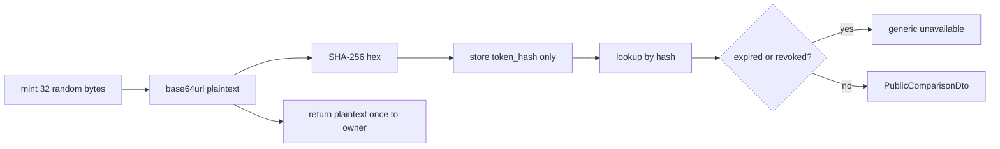

# Comparison share security model

Date: 2026-08-06  
Status: Phase 4C planning  
Parent: [`PHASE4C_PLAN.md`](PHASE4C_PLAN.md) · ADR-030c · Locks D19 / D22 / D24

## Purpose

Define how public comparison share tokens are generated, stored, resolved, rate-limited, and logged so links are unguessable, revocable, and safe against enumeration and data leakage.

## Token lifecycle

### Generation

- CSPRNG: `crypto.randomBytes(32)` (≥ 256 bits entropy).
- Encode: URL-safe base64 without padding (base64url).
- **Never** derive tokens from `user_id`, `comparison_set_id`, `listing_id`, or sequential counters.

### Storage

- Persist **only** `token_hash` = hex(SHA-256(utf8(plaintext))) or equivalent approved construction with the same strength.
- Plaintext must not appear in database columns, backups of structured share rows, or application logs.
- Owner re-fetch must not return plaintext; only replace mints a new token.

### Comparison

- Resolve: hash inbound token, look up by unique `token_hash`.
- Use constant-time equality for any in-memory hash/secret compares where applicable.
- Treat unknown hash, expired (`now >= expires_at`), revoked (`revoked_at IS NOT NULL`), and deleted share identically at the HTTP boundary.

## Public URL

`/{locale}/shared-comparison/{token}`

- Token is the only secret capability.
- No sequential internal IDs in the path.
- Prefer `Referrer-Policy` that avoids leaking the token to third parties (`no-referrer` recommended for the public page).

## Authorization

| Actor | Create / list / revoke / replace | Resolve public |
| ----- | -------------------------------- | -------------- |
| Share owner (verified session) | Yes | Yes (same as anon) |
| Other authenticated user | No | Yes (if token valid) |
| Anonymous | No | Yes (if token valid) |
| Agency / platform admin (4C) | No ad-hoc UI | Via public path only |

Owner APIs use ADR-029 sessions + CSRF. Never trust `x-user-id`, `x-role`, `x-organization-id`, or ownership claims in bodies.

## RLS and resolution privilege

- Enable RLS on `comparison_shares`, `comparison_share_items`, `comparison_share_access_events`.
- Authenticated policies: owner `user_id = jwt.sub` for manage; items via parent ownership.
- **No** anon SELECT policies on these tables.
- `resolvePublicComparisonShare` runs in a narrowly scoped server path with **service-role** (or equivalent) after rate limiting — documented exception (D24). Returns PublicComparisonDto only.

## Rate limits and enumeration resistance

| Action | Limit |
| ------ | ----- |
| `GET /api/v1/compare/shared/{token}` | 60/min/IP |
| Create / replace share | 10/min/user |
| Revoke | 30/min/user |

- Identical JSON/HTML unavailable payload for invalid, expired, and revoked tokens.
- Do not reveal whether a user, comparison, or listing exists.
- Optional progressive delays after repeated failures (implementation detail; document if added).

## Logging and observability

**Allowed:** share UUID (not token), result category, latency, coarse UA category, rate-limit counters.  
**Forbidden:** full plaintext token, Authorization headers, private notes, buyer PII in public-path logs.

Audit events (owner actions): `comparison_share.created`, `.revoked`, `.replaced` with `actorUserId` from session.

## Social preview / bots

- Same resolve path; classify UA as `preview` / `bot` for aggregates when detectable.
- Do not bypass expiry/revocation for crawlers.
- Open Graph / social cards must not embed private fields; prefer generic site title when unavailable.

## Cache headers

Public share responses:

- `Cache-Control: private, no-store` (or `no-cache` with explicit revalidation — prefer no-store for capability URLs)
- `X-Robots-Tag: noindex, nofollow` and/or HTML `noindex`
- Avoid CDN caching of successful share payloads keyed only by URL without auth variance

## Residual risks

- Anyone with the link can view the approved public comparison until expiry/revoke (inherent capability-URL model).
- Referrer leakage if policy is weakened — keep strict policy.
- Owner device clipboard exposure after copy — product UX, not mitigated in server.

## Tests required

- Token entropy / format; hash stored; plaintext absent from DB fixtures
- Expiry and revocation
- Replacement invalidates old token
- Cross-user cannot revoke another’s share
- Rate limit smoke
- Generic unavailable for bad tokens
- Logs scrubbed of plaintext tokens in unit assertions where logging is instrumented
