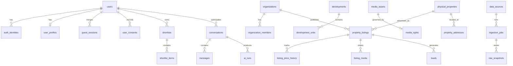

# Spain Property Buyer Portal — Database Design

Version: 1.1  
Status: Phase 0 deliverable (updated with legacy field mapping)  
ORM: Drizzle  
Database: PostgreSQL + PostGIS (+ unaccent, pg_trgm, pgvector)  
Companion: [`ARCHITECTURE.md`](ARCHITECTURE.md), [`IMPLEMENTATION_PLAN.md`](IMPLEMENTATION_PLAN.md), [`LEGACY_CODE_ASSESSMENT.md`](LEGACY_CODE_ASSESSMENT.md)

---

## 1. Design principles

- UUID primary keys; `created_at` / `updated_at` on mutable entities; explicit audit data for sensitive actions
- Soft deletion only where business/audit requirements justify it
- Physical property ≠ commercial listing
- Source claims, normalized values, derived attributes and document verifications are distinct provenance types
- Exact vs approximate coordinates stored with explicit accuracy level
- Channel-neutral conversations from day one; call tables early but unused in MVP
- Row Level Security (RLS) for tenant and user isolation; service-role isolation for workers
- Never collapse multiple agency claims into one value without preserving provenance

---

## 2. Entity-relationship overview



---

## 3. Full entity inventory

All entities from the authoritative specification are retained. None removed for “simplification.”

### 3.1 Identity and authorization

| Entity                       | Purpose                                                         |
| ---------------------------- | --------------------------------------------------------------- |
| `users`                      | Canonical user account                                          |
| `user_profiles`              | Language, currency, communication defaults, display preferences |
| `auth_identities`            | Verified email/mobile (and later passkey/social) identities     |
| `guest_sessions`             | Anonymous session state pending merge                           |
| `user_channel_identities`    | WhatsApp/phone/etc. linked identities                           |
| `organizations`              | Agencies, developers, licensed providers, professional partners |
| `organization_members`       | Staff membership                                                |
| `organization_verifications` | Org verification evidence and status                            |
| `roles`                      | Role definitions                                                |
| `permissions`                | Permission catalog                                              |
| `user_consents`              | Purpose-based consent records                                   |
| `notification_preferences`   | Granular channel/frequency preferences                          |
| `privacy_requests`           | Export and deletion workflow                                    |
| `security_events`            | Abuse, login, revocation and security audit events              |

Role assignment may use join tables (e.g. `organization_member_roles`, `user_roles`) implemented during Phase 1 migrations without dropping the role/permission model.

### 3.2 Geography

| Entity                   | Purpose                                        |
| ------------------------ | ---------------------------------------------- |
| `countries`              | Spain and future expansion                     |
| `autonomous_communities` | e.g. Catalonia, Castilla-La Mancha             |
| `provinces`              | e.g. Barcelona, Albacete                       |
| `comarcas`               | Comarca or island where applicable             |
| `municipalities`         | Municipal level                                |
| `districts`              | District                                       |
| `neighborhoods`          | Neighborhood, locality or village              |
| `postal_codes`           | Postal codes                                   |
| `geo_aliases`            | Historical and alternative names, multilingual |
| `places`                 | Generic place points/polygons with confidence  |
| `amenities`              | Schools, hospitals, shopping, etc.             |
| `transport_stops`        | Stations, stops, airports as applicable        |
| `environmental_layers`   | Coast, terrain, parks, risk overlays           |

Use PostGIS `geometry`/`geography` types and spatial indexes. Store official codes where available.

**Hierarchy**

```text
Spain
└── Autonomous community
    └── Province
        └── Comarca or island, where applicable
            └── Municipality
                └── District
                    └── Neighborhood, locality or village
                        └── Postal code
                            └── Development, building or unit
```

**Seed rule:** Alcaraz must be under Albacete / Castilla-La Mancha, never Catalonia.

### 3.3 Inventory

| Entity                   | Purpose                                               |
| ------------------------ | ----------------------------------------------------- |
| `physical_properties`    | Durable physical asset when confidence sufficient     |
| `property_addresses`     | Structured address parts                              |
| `property_locations`     | Coordinates, accuracy, display policy                 |
| `property_listings`      | Source-specific commercial listing                    |
| `listing_status_history` | Append-only status changes                            |
| `listing_price_history`  | Append-only price changes                             |
| `property_types`         | Controlled vocabulary                                 |
| `features`               | Feature catalog                                       |
| `property_features`      | Listing/property feature links                        |
| `source_claims`          | Advertiser-declared facts with provenance             |
| `derived_attributes`     | Platform-calculated attributes with method/confidence |
| `developments`           | Off-plan / new development master                     |
| `development_units`      | Units within a development                            |
| `offplan_milestones`     | Construction/licence/protection milestones            |
| `property_documents`     | Document metadata                                     |
| `document_verifications` | Verification events for documents                     |
| `media_assets`           | Image/video/floorplan assets                          |
| `media_rights`           | Rights basis, attribution, allowed transforms         |
| `listing_media`          | Ordered media attached to listings                    |
| `property_provenance`    | Field-level provenance summaries                      |
| `duplicate_candidates`   | Potential same-physical matches                       |
| `verification_events`    | Auditable verification actions                        |

**Listing operational states (controlled vocabulary):**  
`draft`, `pending_review`, `published`, `available`, `reserved`, `under_offer`, `sold`, `temporarily_unverified`, `stale`, `withdrawn`, `rejected`

**Freshness timestamp fields on listings (minimum):**  
`source_created_at`, `source_updated_at`, `first_seen_at`, `last_seen_at`, `last_content_change_at`, `last_checked_at`, `last_confirmed_available_at`, `missing_since`, `reserved_at`, `sold_at`, `withdrawn_at`

**Legacy marker:** listings imported from the Barcelona explorer snapshot carry `legacy_snapshot` (status flag and/or provenance method) until rechecked.

### 3.4 Buyer activity

| Entity                                                       | Purpose                                                                        |
| ------------------------------------------------------------ | ------------------------------------------------------------------------------ |
| `favourites`                                                 | User favourites                                                                |
| `shortlists`                                                 | Named shortlists                                                               |
| `shortlist_items`                                            | Items in shortlists                                                            |
| `shortlist_collaborators`                                    | View/comment collaborators                                                     |
| `property_notes`                                             | Personal notes, labels, scores                                                 |
| `comparison_sets`                                            | Comparison sessions                                                            |
| `comparison_items`                                           | Properties in a comparison                                                     |
| `saved_searches`                                             | Persisted versioned `PropertySearchCriteria` (`phase4b.v1`) — **4B shipped**   |
| `search_runs`                                                | Optional executed search analytics (not required for 4B MVP)                   |
| `browsing_history`                                           | Recent property views (replaces draft name `recently_viewed`) — **4B shipped** |
| `user_preference_profiles`                                   | Weighted preference profiles — **4A implemented**                              |
| `saved_search_evaluation_runs` / `saved_search_last_matches` | Alert evaluation — **4B shipped**                                              |
| `in_app_notifications` / `notification_deliveries`           | In-app alerts — **4B shipped**                                                 |
| `alerts` / `alert_subscriptions`                             | Prefer columns on `saved_searches` in 4B; legacy name deprecated               |
| `comparison_shares`                                          | Secure public comparison links (token hash, expiry, revoke) — **4C planned**   |
| `comparison_share_items`                                     | Explicit 2–5 listing selection frozen at create — **4C planned**               |
| `comparison_share_access_events`                             | Privacy-minimal resolve events — **4C planned**                                |

Purchase stages (on notes/items or dedicated field): researching, viewing requested, viewed, offer considered, rejected (extendable).

### 3.5 Leads and conversations

| Entity                      | Purpose                                        |
| --------------------------- | ---------------------------------------------- |
| `leads`                     | Enquiry / lead records                         |
| `lead_property_links`       | Properties linked to a lead                    |
| `viewing_requests`          | Viewing request workflow                       |
| `lead_assignments`          | Partner/staff assignment                       |
| `lead_status_history`       | Append-only lead status                        |
| `conversations`             | Channel-neutral conversation                   |
| `conversation_participants` | Users, agents, system participants             |
| `messages`                  | Channel-neutral messages                       |
| `message_attachments`       | Attachments                                    |
| `message_property_links`    | Properties referenced in messages              |
| `channel_threads`           | Provider thread mapping                        |
| `agent_handoffs`            | Human handoff records and notes                |
| `conversation_summaries`    | AI/human summaries                             |
| `ai_runs`                   | Model run metadata                             |
| `ai_tool_calls`             | Tool call audit                                |
| `communication_deliveries`  | Outbound delivery tracking                     |
| `call_sessions`             | Telephony/browser call sessions (early schema) |
| `call_recordings`           | Recording metadata (unused in MVP)             |
| `call_consents`             | Recording/call consent (unused in MVP)         |

### 3.6 Ingestion

| Entity                     | Purpose                                         |
| -------------------------- | ----------------------------------------------- |
| `data_sources`             | Registered sources                              |
| `source_permissions`       | Permission status and document references       |
| `source_endpoints`         | Endpoints/paths                                 |
| `feed_configs`             | CSV/XML/JSON/API feed configuration             |
| `crawler_configs`          | Authorized crawl schedules and path allow-lists |
| `ingestion_jobs`           | Job runs                                        |
| `ingestion_items`          | Per-record processing items                     |
| `raw_snapshots`            | Immutable raw payloads (hash, retention)        |
| `extraction_results`       | Extracted structured values                     |
| `normalization_events`     | Source → canonical mappings                     |
| `ingestion_errors`         | Validation/parser errors                        |
| `feed_health_events`       | Health metrics over time                        |
| `source_takedown_requests` | Takedown workflow                               |

**Source types:** `api` | `webhook` | `xml` | `json` | `csv` | `manual` | `authorized_crawl` | `legacy_snapshot`

**Permission status:** `pending` | `approved` | `restricted` | `suspended` | `expired`

Jobs must not run when approval is missing, expired or suspended.

### 3.7 Knowledge and rules

| Entity                         | Purpose                                     |
| ------------------------------ | ------------------------------------------- |
| `knowledge_sources`            | Allow-listed publishers                     |
| `knowledge_documents`          | Documents                                   |
| `knowledge_versions`           | Versioned content with review dates         |
| `knowledge_chunks`             | Embeddable chunks for retrieval             |
| `knowledge_citations`          | Citation metadata returned to UI            |
| `jurisdictions`                | Country/region jurisdiction records         |
| `rule_sets`                    | Cost/tax rule set families                  |
| `rule_versions`                | Effective-dated rule versions               |
| `calculator_runs`              | Stored calculation runs with inputs/outputs |
| `document_checklist_templates` | Document readiness templates                |
| `legal_content_reviews`        | Review workflow for legal content           |
| `ai_feedback`                  | User/staff feedback on AI answers           |
| `ai_evaluation_cases`          | Eval fixtures                               |
| `ai_evaluation_runs`           | Eval execution results                      |

---

## 4. Key relationships

| From                  | To                        | Cardinality          | Notes                          |
| --------------------- | ------------------------- | -------------------- | ------------------------------ |
| `physical_properties` | `property_listings`       | 1:N                  | Same home, multiple ads        |
| `developments`        | `development_units`       | 1:N                  | Off-plan                       |
| `development_units`   | `property_listings`       | 0..1:N               | Unit may be listed             |
| `organizations`       | `property_listings`       | 1:N                  | Listing owner/publisher        |
| `data_sources`        | `property_listings`       | 1:N                  | Via provenance                 |
| `media_assets`        | `media_rights`            | 1:1                  | Publish blocked without rights |
| `property_listings`   | `listing_media`           | 1:N                  | Ordered gallery                |
| `users`               | `shortlists`              | 1:N                  | Named lists                    |
| `shortlists`          | `shortlist_collaborators` | 1:N                  | Permissions                    |
| `users`               | `comparison_shares`       | 1:N                  | Owner share links (4C planned) |
| `comparison_shares`   | `comparison_share_items`  | 1:N                  | Frozen listing selection       |
| `users` / guests      | `conversations`           | M:N via participants | Channel-neutral                |
| `conversations`       | `messages`                | 1:N                  | Includes AI and human          |
| `conversations`       | `ai_runs`                 | 1:N                  | Tool audit                     |
| `leads`               | `viewing_requests`        | 1:N                  |                                |
| `saved_searches`      | `alerts`                  | 1:N                  |                                |
| `data_sources`        | `ingestion_jobs`          | 1:N                  | Permission-gated               |
| `ingestion_jobs`      | `raw_snapshots`           | 1:N                  | Immutable                      |
| `physical_properties` | `duplicate_candidates`    | N:N candidate pairs  | Review bands                   |
| `jurisdictions`       | `rule_versions`           | 1:N                  | Cost engine                    |

---

## 5. Provenance model (field-level)

Important facts should be explainable via `source_claims` / `property_provenance` / `derived_attributes`:

```text
fact key
source claim
normalized value
derived value, if any
source ID and URL
method: api | feed | crawl | manual | calculation | document review | legacy_snapshot
confidence
verified by / verified at
rule or extractor version
```

UI examples retained from the spec:

- “Sea proximity calculated from map data.”
- “Energy rating supplied by advertiser; certificate not reviewed.”
- “Completion date supplied by developer and last updated on …”

---

## 6. Media rights model

Per `media_assets` / `media_rights`:

```text
source media ID
source listing ID
original URL or upload reference
rights owner
rights basis and permission version
allowed transformations
attribution
first and last verified timestamps
content hash
perceptual hash
width/height/type
storage variants
status: pending | approved | blocked | expired | removed
```

`image_rights` on sources: `none` | `hotlink_only` | `display` | `download_and_transform`  
Do not hotlink by default. Do not invent or AI-generate property photos as listing evidence.

---

## 7. Migration sequence

Migrations are ordered and additive. Never edit production schema manually.

| Step | Migration focus                                                                                                                      | Phase                                                                                                                            |
| ---- | ------------------------------------------------------------------------------------------------------------------------------------ | -------------------------------------------------------------------------------------------------------------------------------- |
| M00  | Extensions: `uuid-ossp` or `pgcrypto`, `postgis`, `unaccent`, `pg_trgm`, `vector`                                                    | 1                                                                                                                                |
| M01  | Identity: users, profiles, auth_identities, guest_sessions, security_events                                                          | 1                                                                                                                                |
| M02  | AuthZ: organizations, members, verifications, roles, permissions, consents, notification_preferences, privacy_requests               | 1                                                                                                                                |
| M03  | Channel identity stubs: `user_channel_identities`                                                                                    | 1                                                                                                                                |
| M04  | Geography hierarchy + geo_aliases + places                                                                                           | 1–2                                                                                                                              |
| M05  | Amenities, transport_stops, environmental_layers (schema; data later)                                                                | 2–6                                                                                                                              |
| M06  | Inventory core: physical_properties, addresses, locations, listings, types, features, source_claims, derived_attributes, provenance  | 2                                                                                                                                |
| M07  | Histories: listing_status_history, listing_price_history, verification_events                                                        | 2                                                                                                                                |
| M08  | Media: media_assets, media_rights, listing_media                                                                                     | 2                                                                                                                                |
| M09  | Off-plan: developments, development_units, offplan_milestones, property_documents, document_verifications                            | 2 / 6                                                                                                                            |
| M10  | Buyer workspace: favourites (P2); shortlists/notes/comparisons/prefs (P4A); shares (P4C planned); `saved_searches`, `browsing_history` (P4B) | **4** ([`PHASE4_DATABASE_CHANGES.md`](PHASE4_DATABASE_CHANGES.md), [`PHASE4B_DATABASE_CHANGES.md`](PHASE4B_DATABASE_CHANGES.md), [`PHASE4C_DATABASE_CHANGES.md`](PHASE4C_DATABASE_CHANGES.md)) |
| M11  | Alerts: evaluation runs, last matches, `in_app_notifications`, `notification_deliveries` (P4B); email deliveries later               | **4B** foundation / 4.1+ channels                                                                                                |
| M12  | Leads: leads, links, viewing_requests, assignments, status history                                                                   | **4.1+** (deferred from Phase 4 scope lock)                                                                                      |

| M13 | Conversations: conversations, participants, messages, attachments, property links, channel_threads, handoffs, summaries | 5–6 |
| M14 | AI: ai_runs, ai_tool_calls, ai_feedback, evaluation tables | 5 |
| M15 | Communications: communication_deliveries; call_sessions, call_recordings, call_consents (disabled in app config) | 6 |
| M16 | Ingestion: data_sources through source_takedown_requests, duplicate_candidates | 3 (ADR-022; was 4) |
| M17 | Knowledge and rules: knowledge__, jurisdictions, rule__, calculator_runs, document_checklist_templates, legal_content_reviews | 5–6 |
| M18 | RLS policies for all user/partner-scoped tables; service roles for workers | 1+ incremental |
| M19 | Seeds: Spain geography (full hierarchy capability), Catalonia focus depth, Alcaraz correctness check, fixture listings | 2 |
| M20 | Indexes: GiST/Geog for locations, GIN for FTS/trgm, unique (source_id, external_listing_id), price/status history | ongoing |

---

## 8. Indexing and constraints (minimum)

- Unique `(data_source_id, external_listing_id)` for listings from feeds
- Unique verified identity values per auth provider type
- Spatial indexes on `property_locations` and geography polygons
- FTS / trigram indexes on searchable listing text fields
- Partial indexes for `published`/`available` listings in public search
- Append-only history tables: no updates to historical price/status rows
- Foreign keys with explicit `ON DELETE` policies (restrict vs cascade documented per table in implementation)
- Check constraints for non-negative beds/baths/areas; positive prices; known currencies

---

## 9. RLS strategy (summary)

| Subject                                | Typical access                                                             |
| -------------------------------------- | -------------------------------------------------------------------------- |
| Anonymous                              | Read published listings and public geography only                          |
| Registered buyer                       | Own profile, workspace, conversations, leads they created                  |
| Shortlist collaborator                 | Shared shortlist per granted permission                                    |
| Organization member                    | Own org listings, imports, leads assigned to org                           |
| Admin roles                            | Review queues, sources, privacy requests per permission                    |
| Service role (worker/AI tools backend) | Bypasses RLS only in locked-down server contexts; never exposed to browser |

Detailed policies and threat controls: [`SECURITY_AND_PRIVACY.md`](SECURITY_AND_PRIVACY.md).

---

## 10. Seed and fixture data

| Dataset                                                  | Purpose                                                                           |
| -------------------------------------------------------- | --------------------------------------------------------------------------------- |
| Geography seed                                           | Spain communities/provinces; deeper Catalonia municipalities; Alcaraz correctness |
| `data/fixtures/`                                         | Synthetic listings for CI edge cases                                              |
| `data/legacy/barcelona_property_explorer_legacy_60.json` | **Present** — Phase 2 `legacy_snapshot` import (see §13)                          |
| Knowledge seed                                           | Minimal approved educational stubs with review dates (Phase 5)                    |
| Rule seed                                                | Initial Catalonia acquisition-cost rule versions (Phase 6)                        |

Legacy import rules: preserve original source URLs; mark `legacy_snapshot`; do not invent images; do not describe as live/verified until rechecked; do not scrape portal HTML/images from URLs.

---

## 11. Retention classes (database support)

Retention schedules are enforced by jobs; schema must support:

- `retention_class` on messages and related AI data
- Soft-delete / anonymization markers for users under privacy deletion
- Raw snapshot retention windows and access restrictions
- Call recording retention fields (unused until Phase 8)

See [`SECURITY_AND_PRIVACY.md`](SECURITY_AND_PRIVACY.md) for GDPR schedules.

---

## 12. Out of scope for early migrations (schema still created where listed)

- Enabling telephony recording features
- Populating nationwide amenity/risk layers before licensed data is available
- Search-engine dual-write tables (only if/when Typesense/OpenSearch is justified)

---

## 13. Legacy JSON → canonical entity mapping

**Source file:** `data/legacy/barcelona_property_explorer_legacy_60.json`  
**Source registry id:** `legacy-barcelona-explorer-60` (`source_type: legacy_snapshot`, `permission_status: restricted`, `image_rights: none`)  
**External listing id:** `String(id)`  
**Idempotency key:** `(data_source_id, external_listing_id)`

### 13.1 Field map

| Legacy field      | Canonical target                                                                    | Notes                                                                                     |
| ----------------- | ----------------------------------------------------------------------------------- | ----------------------------------------------------------------------------------------- |
| `id`              | `property_listings.external_listing_id`                                             | Also store in provenance                                                                  |
| `title`           | listing title (source language `en`)                                                | Preserve as source claim                                                                  |
| `url`             | `property_listings` / provenance `source_url`                                       | May be search-page URL for some Idealista/Fotocasa rows — store as-is; flag weak identity |
| `portal`          | organization/source label + `source_claims`                                         | Not proof of partnership                                                                  |
| `area`            | geography match → municipality/neighborhood + `geo_aliases`                         | Eixample, Sant Gervasi, Sitges, Maresme, Gavà Mar, Vallvidrera → Catalonia seeds          |
| `price`           | listing price + `listing_price_history` (initial)                                   | Currency EUR                                                                              |
| `bedrooms`        | listing / physical beds                                                             | Source claim                                                                              |
| `size_sqm`        | built area m² (source claim)                                                        | Distinguish later from usable if known                                                    |
| `price_per_sqm`   | derived or stored computed display field                                            | Recompute on import; compare to stored for QA                                             |
| `address`         | `property_addresses` free-text / structured parse best-effort                       | Often approximate                                                                         |
| `nearest_transit` | `source_claims` / amenity text                                                      | Not a structured stop id                                                                  |
| `commute_min`     | `derived_attributes` or claim `commute_to_center_min`                               | Assumption: Barcelona center; not multi-destination                                       |
| `beach_proximity` | lifestyle/claim; nullify when `N/A`                                                 | Separate advertiser vs calculated later                                                   |
| `park_proximity`  | lifestyle/claim                                                                     |                                                                                           |
| `property_type`   | normalize → `property_types` + keep raw in `source_claims` / `normalization_events` | See §13.2                                                                                 |
| `category`        | `derived_attributes` lifestyle: `city_center` / `coastal` / `hillside`              | **Not** an admin geography node                                                           |

### 13.2 `property_type` normalization (initial)

| Source examples                                         | Canonical (illustrative)                                        |
| ------------------------------------------------------- | --------------------------------------------------------------- |
| apartment, Flat, Ground Floor Flat, New Build Apartment | `apartment` (+ flags for new_build / ground_floor when present) |
| penthouse                                               | `penthouse`                                                     |
| villa, Detached Villa, House/Chalet                     | `villa` or `detached_house` per mapping table                   |
| Detached House                                          | `detached_house`                                                |
| Semi-detached House                                     | `semi_detached_house`                                           |
| townhouse                                               | `townhouse`                                                     |

Always persist the raw source string and mapping rule version.

### 13.3 What not to invent on import

- Images / media_assets
- Bathrooms, energy rating, coordinates (unless separately geocoded under provider rights with accuracy labelled)
- Sold/withdrawn inference
- Agency partnership or media rights

### 13.4 Listing publication on import

- Status: publishable as `published` only with clear UI `legacy_snapshot` / unverified labelling, **or** `pending_review` then publish with badge — product default: allow public browse with **visible snapshot badge** and freshness “unknown / snapshot date”.
- `last_confirmed_available_at`: null
- Method: `legacy_snapshot`
