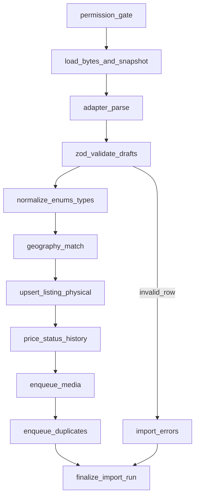

# Ingestion architecture — Phase 3

Date: 2026-08-05  
Status: Planning  
Related: [`PHASE3_PLAN.md`](PHASE3_PLAN.md), [`SOURCE_PERMISSION_MODEL.md`](SOURCE_PERMISSION_MODEL.md), [`PHASE3_DATABASE_CHANGES.md`](PHASE3_DATABASE_CHANGES.md)

## Principles

1. Only **approved** sources may run publication-capable jobs.
2. Adapters parse bytes into a shared **canonical draft**; they do not write business tables directly.
3. Persist is **idempotent** on `(data_source_id, external_listing_id)`.
4. Invalid rows **quarantine**; the batch continues.
5. Raw payloads are retained for **replay** and audit.
6. **No unauthorized scraping** or CAPTCHA bypass adapters.

## Package layout (planned)

```text
packages/ingestion/
  src/
    adapters/
      types.ts              # FeedAdapter interface
      csv/spain-partner-v1.ts
      json/generic-v1.ts
      xml/generic-v1.ts
      legacy/               # existing Barcelona 60 path (unchanged contract)
    pipeline/
      validate.ts
      normalize.ts
      geo-match.ts
      persist.ts
      media-enqueue.ts
      duplicates-enqueue.ts
      permission-gate.ts
    jobs/
      import-run.ts
      freshness-scan.ts
      media-process.ts
      duplicates-scan.ts
    cli.ts
```

## FeedAdapter interface

```ts
interface FeedAdapter {
  readonly format: 'csv' | 'json' | 'xml' | 'legacy_snapshot';
  readonly parserVersion: string;
  parse(input: { bytes: Uint8Array; contentType?: string }): Promise<ParseResult>;
}

interface ParseResult {
  drafts: CanonicalListingDraft[];
  rawRecords: unknown[]; // parallel index for quarantine
  warnings: { index: number; code: string; message: string }[];
}

interface CanonicalListingDraft {
  externalListingId: string;
  title: string;
  description?: string;
  priceAmount: number;
  currency: 'EUR';
  bedrooms?: number;
  bathrooms?: number;
  builtAreaSqm?: number;
  propertyTypeRaw: string;
  environmentTypeRaw?: string;
  municipalityName?: string;
  neighborhoodName?: string;
  addressText?: string;
  lat?: number;
  lng?: number;
  locationAccuracy?: 'exact' | 'approximate' | 'area_only' | 'unknown';
  operationalStatusRaw?: string;
  sourceUpdatedAt?: string; // ISO
  imageUrls?: string[];
  features?: string[];
  sourceUrl?: string;
}
```

## Spain Partner CSV v1 (vertical slice)

Required columns:

| Column          | Notes                                  |
| --------------- | -------------------------------------- |
| `external_id`   | Stable partner key                     |
| `title`         | Required                               |
| `price_eur`     | Numeric EUR                            |
| `property_type` | Mapped via normalize table             |
| `status`        | Mapped to `listing_operational_status` |

Optional: `description`, `currency` (default EUR), `bedrooms`, `bathrooms`, `built_area_sqm`, `environment_type`, `municipality`, `neighborhood`, `address_text`, `lat`, `lng`, `location_accuracy`, `source_updated_at`, `image_urls` (pipe or semicolon separated), `features` (pipe-separated).

Dry-run: parse + validate + sample normalize output; **no** `property_listings` writes.

## Pipeline stages



### Permission gate

Refuse when `permission_status` ∉ {`approved`} for partner feeds. Legacy snapshot exception remains for `legacy-barcelona-explorer-60` only (restricted + snapshot labelling).

### Persist

Reuse Phase 2 patterns from `packages/ingestion/src/legacy/importer.ts`:

- Upsert listing by `(data_source_id, external_listing_id)`
- Provisional `physical_properties` + address/location
- Set `organization_id` from `data_sources.organization_id`
- Partner rows: `freshness_method=partner_feed`, `is_legacy_snapshot=false`
- New imports default `operational_status=pending_review` until admin publish (slice rule)
- Do not set `is_public_browseable=true` until publish

### History

- Price change → one `listing_price_history` row
- Status change → one `listing_status_history` row
- Identical reimport → no history spam

### Freshness job (separate)

On successful **full** sync: listings absent from the snapshot set enter `temporarily_unverified` (then later `stale`/`withdrawn` by threshold). Failed/incomplete runs must not mark missing.

## Job graph

| Job               | Trigger                               | Responsibility                                |
| ----------------- | ------------------------------------- | --------------------------------------------- |
| `import.run`      | Partner upload / admin fixture        | Gate → snapshot → pipeline                    |
| `import.continue` | Large files                           | Chunked continue                              |
| `media.process`   | After persist with image URLs         | Fetch only if rights allow; store; rights row |
| `duplicates.scan` | After persist / nightly               | Write `duplicate_candidates`                  |
| `freshness.scan`  | After successful full sync / schedule | Lifecycle transitions                         |

Providers: `JOBS_PROVIDER=inline` (tests), `pgboss` (local/dev default per ADR-024).

## Raw snapshots and replay

1. Before parse, store immutable `raw_snapshots` row (sha256, parser_version, bytes or storage_ref).
2. Replay loads snapshot, runs newer parser, persists with same idempotency keys.
3. Retention: configurable (default 90 days planning); legal hold via admin flag.

## Failure modes

| Failure                       | Behaviour                                                       |
| ----------------------------- | --------------------------------------------------------------- |
| Permission denied             | Job fails fast; no listing writes                               |
| Malformed file                | Run `failed` or `completed_with_errors`; snapshot kept          |
| Row validation                | Quarantine row; continue                                        |
| Downstream DB error mid-batch | Prefer transaction per row or savepoints; report partial counts |
| Media rights insufficient     | Skip asset; placeholder media only                              |
| Worker crash                  | pg-boss retry with idempotent persist                           |

## Relationship to legacy importer

Legacy Barcelona 60 remains a dedicated adapter under `legacy/` paths. It must not be used as the partner CSV path. Shared helpers: normalize maps, report shape, provenance writer.

## Out of scope adapters

- Idealista/Fotocasa scrapers
- Any CAPTCHA or paywall bypass
- Unauthorized crawl of `authorized-crawl-placeholder` until written domain authorization exists
