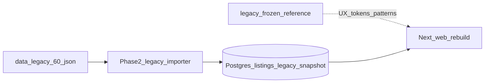

# Legacy Code Assessment — Barcelona Property Explorer

Version: 1.0  
Date: 2026-08-05  
Status: Phase 0 addendum (assessment only; Phase 1 not started)  
Authoritative product spec: [`spain_property_portal_build_plan_and_master_prompt_v2.md`](spain_property_portal_build_plan_and_master_prompt_v2.md)  
Related: [`IMPLEMENTATION_PLAN.md`](IMPLEMENTATION_PLAN.md), [`ARCHITECTURE.md`](ARCHITECTURE.md), [`DATABASE_DESIGN.md`](DATABASE_DESIGN.md), [`DECISIONS_REQUIRED.md`](DECISIONS_REQUIRED.md), [`EXTERNAL_SERVICES.md`](EXTERNAL_SERVICES.md)

---

## 0. Repository location note

| User / pack reference | Actual path in this repository |
|-----------------------|--------------------------------|
| `legacy/barcelona-property-explorer-preview` | **Not present** as a subdirectory |
| Supplied preview application | [`legacy/`](../legacy/) (contains `client/`, `server/`, `shared/`, configs) |
| Extracted 60-record dataset | [`data/legacy/barcelona_property_explorer_legacy_60.json`](../data/legacy/barcelona_property_explorer_legacy_60.json) |
| Duplicate embedded copy | [`legacy/client/src/data/properties.json`](../legacy/client/src/data/properties.json) — **identical** to the extracted JSON |

**Policy:** Do not delete or modify files inside `legacy/`. Treat it as a frozen reference. Canonical import input for the new platform is `data/legacy/barcelona_property_explorer_legacy_60.json`.

---

## 1. Editable source vs compiled assets

### Verdict

**The legacy application contains editable source code**, not only compiled production assets.

### Evidence

- Full TypeScript/React client under `legacy/client/src/` (pages, components, hooks, CSS).
- Express server entry and stubs under `legacy/server/`.
- Shared Drizzle schema under `legacy/shared/schema.ts`.
- Tooling: `package.json`, `vite.config.ts`, `tsconfig.json`, `tailwind.config.ts`, `script/build.ts`.
- **No** checked-in `dist/` production build observed.

### Implication

The earlier build-pack statement that the preview “does not contain a source-code repository suitable for continued development” remains directionally correct for **product continuation**: the app is a narrow SPA demo on a generic template, not a production Spain portal. However, unlike a pure compiled dump, engineers **can** run and inspect the UI source. It must still be treated as a **reference**, not lifted into the planned monorepo as the production foundation.

---

## 2. Framework, dependencies, structure and build format

### 2.1 Structure

```text
legacy/
  client/                 # Vite root (React SPA)
    index.html
    src/
      App.tsx             # Wouter hash router; Home only
      pages/Home.tsx
      components/         # PropertyCard, FilterPanel, ComparisonTable, SummaryStats, Logo
      components/ui/      # Large shadcn/Radix kit (mostly unused by explorer UX)
      data/properties.json
      hooks/use-properties.ts
      lib/                # types, format, theme-provider, queryClient
      index.css           # design tokens (light/dark)
  server/                 # Express + Vite middleware scaffolding
    index.ts, routes.ts   # routes empty of property APIs
    storage.ts            # SQLite users CRUD only
  shared/schema.ts        # users table only
  script/build.ts         # Vite client + esbuild server
  package.json            # name: "rest-express"
```

### 2.2 Identifiable stack

| Layer | Technology |
|-------|------------|
| UI | React 18.3, TypeScript 5.6 |
| Bundler (client) | Vite 7 + `@vitejs/plugin-react` |
| Routing | Wouter 3 with **hash location** |
| Styling | Tailwind CSS 3 + `tailwindcss-animate`; shadcn-style Radix primitives |
| Data fetching kit | TanStack React Query (present; properties loaded via static JSON import) |
| Server | Express 5, `tsx` for dev; production `node dist/index.cjs` |
| ORM stub | Drizzle ORM + **better-sqlite3** (not Postgres/PostGIS) |
| Forms / UI extras | React Hook Form, Zod, Framer Motion, Lucide, cmdk, vaul, etc. |
| Build (server) | esbuild bundle to CJS |
| Client base path | `base: "./"` (relative asset paths; preview-friendly) |

### 2.3 How properties actually work

1. JSON is imported statically into `use-properties.ts`.
2. Filters run **entirely in the browser** (`useMemo` over 60 records).
3. Express exposes **no** `/api/properties` endpoints.
4. “View listing” opens the original portal URL in a new tab; there is **no** in-app property detail page.

### 2.4 Unused / template residue

Dependencies such as Passport, express-session, `@supabase/supabase-js`, Recharts, and most of `components/ui/` are not part of the explorer’s core journey. Package name `rest-express` indicates a generic scaffold. Dev scripts use Unix-style `NODE_ENV=development` which is hostile to Windows PowerShell without a cross-env helper.

---

## 3. UI patterns, layouts, filters, comparison, styles and behaviours to preserve

Preserve these as **product/UX requirements** for the new Next.js portal (rebuild, do not copy blindly).

### 3.1 Layout and chrome

- Full-viewport app shell (`h-dvh`) with sticky header and scrollable main.
- Brand lockup: logo + title + short subtitle (“City center · Coast · Hillside”).
- Dark / light theme toggle with Mediterranean token sets.
- Desktop: fixed left filter sidebar (~280px) + main results.
- Mobile: filters inside a collapsible `<details>` block above results.

### 3.2 Views

- Toggle between **Cards** and **Compare** (table).
- Card grid: 1 / 2 / 3 columns by breakpoint.
- Comparison table: sortable columns; sticky first column; mobile swipe hint for overflow.

### 3.3 Filters

- Free-text search across title, area, address, portal.
- Multi-select neighborhood types: City Center, Coastal, Hillside (with short descriptions).
- Multi-select areas (derived from data).
- Range sliders: price, size (m²), max commute to center, minimum bedrooms.
- Reset filters; live result count (“N of 60 listings match”).
- Empty state when no matches.

**Do not blindly preserve** the default `bedroomsMin: 2` as a hard product default for the Spain portal (it hides smaller homes). Preserve the control; reconsider default for MVP.

### 3.4 KPI summary strip

Matching count, average price, average €/m², average commute, fastest commute — updating with the filtered set. In the new product, add the spec’s **tiny-sample caution** (avoid misleading averages when N is very small) and prefer median where the spec requires it.

### 3.5 Card and table content

- Category/area badge colour coding (chart-1/2/3 tokens).
- Portal label; title; address; full price + €/m²; beds; size; transit + commute; beach or park proximity; external listing link.

### 3.6 Visual language

From `client/src/index.css` / `index.html`:

- Light: sand/warm neutrals, deep sea teal primary, terracotta accents.
- Dark: corresponding dark sidebar/background tokens.
- Fonts: **General Sans** (sans), **Fraunces** (serif), **JetBrains Mono** (mono) via Fontshare/Google Fonts.
- Compact radius (`0.5rem`), tabular nums for money, restrained elevation.

The authoritative build pack asked to preserve the strongest aspects of the original dark dashboard while making trust, provenance, images, accessibility and mobile first-class — this assessment endorses that direction.

### 3.7 Testability

Widespread `data-testid` attributes (`card-property-*`, `panel-filters`, `table-comparison`, etc.) are worth mirroring in the new app’s Playwright suite.

---

## 4. What can be reused vs what must be rebuilt

### 4.1 Safe to reuse as reference (not as production modules)

| Asset | Use |
|-------|-----|
| Design tokens / palette / typography choices | Recreate in `packages/ui` or Next global CSS |
| UX patterns (sidebar filters, card/table toggle, KPI strip, compare table behaviours) | Rebuild in App Router with URL-backed state |
| Price formatting logic | Port ideas into shared `format` utilities |
| Flat field vocabulary | Drive Phase 2 legacy importer mapping |
| `data-testid` naming ideas | E2E conventions |
| Embedded JSON (via `data/legacy/…`) | Import as `legacy_snapshot` |

### 4.2 Must rebuild (do not lift-and-shift)

| Legacy piece | Why |
|--------------|-----|
| Vite SPA + Wouter hash routing | Spec requires Next.js, SEO, shareable search URLs, i18n/RTL |
| Client-only JSON inventory | Spec requires Postgres/PostGIS, provenance, freshness, RLS |
| Express + SQLite + unused users schema | Wrong auth model; not PostGIS; password field design unsafe |
| Empty API / no BFF | Need versioned `/api/v1` domain API |
| shadcn kit wholesale copy | Audit a11y; align with monorepo `packages/ui`; avoid unused bloat |
| Outbound-only “detail” | Need first-party detail pages with gallery, provenance, AI actions |
| Entire missing domains | Auth OTP, workspace, AI, ingestion, partners, admin, channels |

### 4.3 Explicitly do not copy

- Plaintext-oriented `users.password` schema pattern.
- Any scraper that fetches Idealista/Fotocasa/Engel/etc. pages from stored URLs without written permission and media rights.
- Invented property images.
- Claiming snapshot rows as live/verified inventory.

---

## 5. Schema and quality of the 60-property JSON dataset

### 5.1 Schema (every record)

```text
id                 number (1–60, unique)
title              string
url                string (portal URL)
portal             string
area               string
price              number (EUR asking)
bedrooms           number
size_sqm           number
price_per_sqm      number
address            string
nearest_transit    string (free text)
commute_min        number (minutes to “center”)
beach_proximity    string (or "N/A")
park_proximity     string
property_type      string (inconsistent vocabulary)
category           "City Center" | "Coastal" | "Hillside"
```

### 5.2 Aggregate quality

| Check | Result |
|-------|--------|
| Record count | 60 |
| Unique ids | 60 |
| Identity with embedded `properties.json` | Identical |
| Price range | €299,000 – €6,700,000 |
| `price_per_sqm` vs price/size | Consistent (tolerance ±2) |
| Images / bathrooms / lat-lng / description / energy | **Absent** |
| Alcaraz | **Not present** in this dataset |

**Areas:** Sitges 12, Maresme 12, Gavà Mar 11, Vallvidrera 9, Eixample 8, Sant Gervasi 8  

**Categories:** Coastal 35, City Center 16, Hillside 9  

**Portals:** Engel & Völkers 19, Coldwell Banker 14, Lucas Fox 13, Fotocasa 9, Idealista 5  

**URL hosts:** engelvoelkers.com, coldwellbanker.es, fotocasa.es, lucasfox.es / lucasfox.com, idealista.com  

### 5.3 Quality / rights issues

1. **`property_type` inconsistency** — e.g. `apartment` vs `Flat` vs `New Build Apartment` vs `House/Chalet` vs `Detached House`. Importer must normalize to a controlled vocabulary while preserving the source claim.
2. **Some Idealista/Fotocasa URLs are search or category pages**, not single-listing expose URLs — weak provenance for a specific unit; still store URL as supplied; do not invent a better URL.
3. **No media** — correct per policy (do not invent images). Public cards in the new app must work text-first or with placeholders that are not presented as listing photography.
4. **Lifestyle `category` ≠ Spain geography** — map into `derived_attributes` / lifestyle classifications; place `area` into Catalonia geography seeds (municipality/neighborhood), not under wrong communities.
5. **Commute** is a single opaque “to center” integer — import as a source/derived claim with explicit assumption; later replace with multi-destination commute profiles.
6. **Rights status:** snapshot/demo only. Portal URLs are **not** a licence to republish descriptions or images. Idealista/Fotocasa especially require caution; no automated fetch/scrape.

### 5.4 Fitness for Phase 2

**Fit for:** deterministic `legacy_snapshot` import, filter UI demos, comparison UX, provenance labelling, importer tests.  

**Not fit alone for:** commercial “live inventory” MVP acceptance without a permitted live source path; image galleries; map pins with real coordinates; legal/energy completeness.

---

## 6. Differences vs the authoritative project specification

| Spec requirement | Legacy preview |
|------------------|----------------|
| Spain-wide geography hierarchy | Barcelona-metro areas + 3 lifestyle categories only |
| Physical property ≠ listings | Single flat record |
| Provenance, freshness, media rights | Absent |
| Auth email/SMS OTP, guest merge | Absent (unused SQLite users stub only) |
| Favourites, shortlists, saved searches, alerts | Absent |
| Map + list sync + polygon/radius/commute search | Absent |
| In-app property detail, gallery, price history | External link only |
| Partner / admin portals | Absent |
| Multilingual en/es/ca/ar + RTL | English-only UI |
| Website AI chat + typed tools | Absent |
| Channel-neutral conversations | Absent |
| Ingestion pipeline / source registry | Static JSON |
| Versioned cost rules / document readiness | Absent |
| WCAG 2.2 AA target | Partial; see §7 |
| URL-backed shareable search state | Hash router; filters not in URL |
| KPI medians + tiny-sample caution | Means only; no caution |

**Conclusion:** Legacy is a useful **UX and sample-data prototype** for Catalonia/Barcelona discovery. The production architecture in the Phase 0 docs remains necessary and is **not** invalidated — only enriched with concrete mapping and UI inheritance guidance.

---

## 7. Security, maintainability, accessibility and responsive-design problems

### 7.1 Security / data rights

- SQLite `users.password` text field pattern is incompatible with the planned OTP/Supabase model and must not be reused.
- Outbound links to major portals without a rights/freshness model risk implying licensed live inventory.
- No CSP/security headers story in the SPA preview.
- Template includes unused auth/session libraries that expand attack surface if accidentally enabled.

### 7.2 Accessibility

- `maximum-scale=1` on the viewport meta tag **blocks pinch-zoom** — do not carry into production.
- Filter `<details>`/`summary` pattern needs keyboard and accessible name review in the rebuild.
- Comparison table horizontal scroll needs keyboard-accessible alternatives (spec: accessible non-map **and** usable tables).
- Colour-only category cues should remain paired with text labels (legacy mostly does).

### 7.3 Responsive design

- Card/filter layout is generally sound for mobile/desktop.
- Wide comparison table (`min-w-[1100px]`) depends on swipe; keep swipe hint and add better mobile compare strategies in the new product (e.g. column picker or stacked compare).

### 7.4 Maintainability

- Generic template bloat vs small feature surface.
- Business logic mixed in hooks with static JSON — not separable domain packages.
- No tests alongside the explorer components.
- Windows-unfriendly npm scripts.
- Duplicate dataset (legacy folder + `data/legacy`) — designate `data/legacy` as canonical for imports.

---

## 8. Safe migration path into the planned monorepo



### Steps (planning order; Phase 1 still not started)

1. **Freeze** `legacy/` — read-only reference; no product edits.
2. **Canonicalize data** at `data/legacy/barcelona_property_explorer_legacy_60.json`.
3. **Phase 1** (when separately approved): scaffold monorepo (Next.js, Supabase Postgres/PostGIS, Drizzle) — **do not** vendor the Vite/Express app as `apps/web`.
4. **Phase 2:** implement `legacy_snapshot` importer:
   - Map flat rows → `physical_properties` + `property_listings` + `source_claims` / `derived_attributes`.
   - Preserve `url`, `portal`, titles, numeric facts.
   - Normalize `property_type`; keep raw source value.
   - Map areas into Catalonia geography seeds.
   - Set listing method/`legacy_snapshot`; no media rows unless rights-cleared assets appear later.
   - Idempotent on `(source_id, external_listing_id)` where `external_listing_id = String(id)`.
5. **Rebuild UI** in `apps/web`: inherit tokens and UX patterns; add list view, map, detail, provenance badges, i18n, URL state.
6. **Never** scrape portal URLs for HTML/images without register approval.
7. Keep a small synthetic fixture set for CI edge cases in addition to the real 60.

### What not to do

- Do not move `legacy/` into `apps/web`.
- Do not switch the locked stack to SQLite/Wouter to “save time”.
- Do not publish legacy rows without snapshot labelling.
- Do not modify files under `legacy/` as part of migration.

---

## 9. Impact on architecture, database design and phased roadmap

### 9.1 Architecture

- **No stack pivot.** Keep pnpm/Turborepo, Next.js, Supabase Postgres/PostGIS, Drizzle, TypeScript AI service.
- Add an explicit **legacy reference boundary**: frozen SPA + JSON → importer + UI rebuild.
- Document UI inheritance (tokens/patterns) in architecture docs.

### 9.2 Database design

- No removal of planned entities.
- Add a **legacy field-mapping appendix** (see [`DATABASE_DESIGN.md`](DATABASE_DESIGN.md)).
- Ensure controlled vocabularies and normalization events capture inconsistent `property_type` and lifestyle `category`.

### 9.3 Roadmap

| Item | Adjustment |
|------|------------|
| Phase 0 | Extended by this assessment; still no app scaffold |
| Phase 1 | Unchanged scope; still requires explicit approval to start |
| Phase 2 | Legacy JSON import **unblocked** for file presence; still `legacy_snapshot` until rights/freshness review |
| Phases 3–9 | Unchanged |
| MVP live-import gate | Still needs a **permitted** live path beyond this snapshot; Idealista/Fotocasa URLs do not satisfy that gate |

### 9.4 Decisions updates

- ADR-010 revised: file present; import rules remain strict.
- D-016 file-supply closed; rights review remains open.
- New ADR: freeze-and-rebuild (no lift-and-shift).
- Path alias documented: `barcelona-property-explorer-preview` ≡ `legacy/`.

---

## 10. Assessment checklist (complete)

- [x] Editable source vs compiled assets determined
- [x] Framework, dependencies, structure, build format identified
- [x] UI patterns to preserve listed
- [x] Reuse vs rebuild boundaries defined
- [x] 60-property JSON schema and quality assessed
- [x] Spec gaps documented
- [x] Security / a11y / responsive / maintainability issues listed
- [x] Safe migration path defined
- [x] Architecture / DB / roadmap adjustments identified
- [x] Phase 1 / production app **not** started
- [x] `legacy/` directory **not** modified
