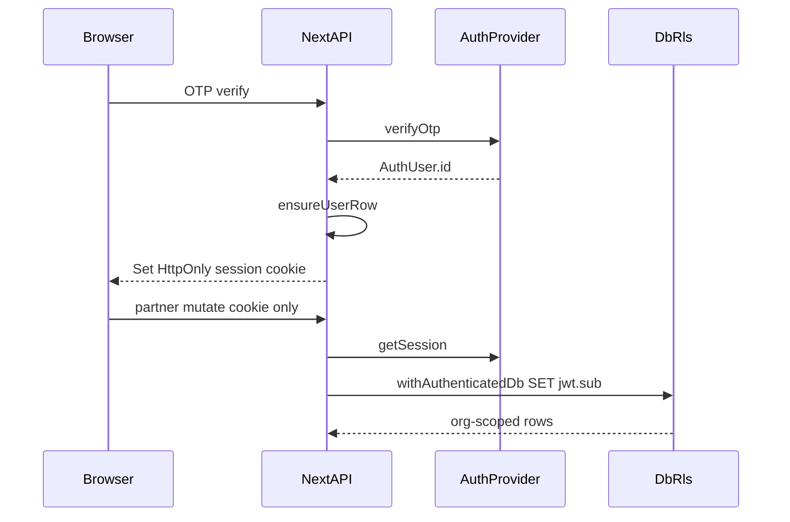

# Phase 3.1 auth plan — Authenticated agency and administrator sessions

Date: 2026-08-06  
Status: **Implemented** — see [`PHASE3_1_IMPLEMENTATION.md`](PHASE3_1_IMPLEMENTATION.md)  
Branch baseline: `cursor/phase2-legacy-inventory-buyer-journey` @ Phase 3 CSV slice (`71c80b1`)  
Companions: [`AUTHORIZATION_MATRIX.md`](AUTHORIZATION_MATRIX.md), [`SESSION_SECURITY_DESIGN.md`](SESSION_SECURITY_DESIGN.md), [`PHASE3_1_ACCEPTANCE_CRITERIA.md`](PHASE3_1_ACCEPTANCE_CRITERIA.md)

## Objective

Replace client-controlled identity (`x-user-id`, client-writable `spain_user_id`, `DevIdentitySwitcher`) with **verified AuthProvider sessions** for buyers, agency users, and platform administrators—without starting Phase 4, JSON/XML feeds, WhatsApp, voice, or AI.

## Non-goals

- Phase 4 buyer workspace (shortlists, alerts, leads beyond favourites)
- JSON/XML partner adapters; unauthorized crawling
- WhatsApp, voice, AI buyer guidance
- Introducing `x-organization-id` or `x-role` as authority
- Destructive rewrite of Phase 3 seeded user/org/listing data

## Role vocabulary mapping (no schema rename)

| Product term     | Stored role key(s)       |
| ---------------- | ------------------------ |
| Agency admin     | `org_owner`, `org_admin` |
| Agency editor    | `org_agent`              |
| Agency viewer    | `org_viewer`             |
| Platform admin   | `platform_admin`         |
| Listing reviewer | `listing_reviewer`       |

---

## Current trust inventory

| Surface                                           | Location                                                                | Trusted for                            | Risk                                  |
| ------------------------------------------------- | ----------------------------------------------------------------------- | -------------------------------------- | ------------------------------------- |
| Header `x-user-id`                                | `apps/web/src/lib/db.ts` `readUserId`; partner/admin/favourites clients | User identity                          | **Critical** — full spoof             |
| Cookie `spain_user_id`                            | Set by `AuthPanel.tsx`, `demo-identities.ts`; read by `readUserId`      | User identity                          | **Critical** — client-writable        |
| `DevIdentitySwitcher`                             | Partner/admin pages + `demo-identities.ts`                              | Switches demo UUIDs via cookie         | **High** if non-local                 |
| `resolvePartnerContext` / `resolveAdminContext`   | `apps/web/src/lib/partner-auth.ts`                                      | Authz after `readUserId`               | Correct org/role **after** spoofed id |
| `requireSoleOrganization` / `requirePlatformRole` | `packages/database/src/services/organizations.ts`                       | Org/platform from DB                   | Good once userId is verified          |
| OTP verify body `guestKey` / `guestPayload`       | Auth OTP verify + AuthPanel                                             | Guest merge                            | High (buyer merge forgery)            |
| Response `userId` then client self-stores         | OTP verify → cookie/header                                              | Identity bootstrap                     | Must become server session            |
| `x-organization-id` / `x-role`                    | **Not present**                                                         | —                                      | Do **not** introduce                  |
| Listing/org ids in path/body                      | Partner/admin routes                                                    | Resource ids only after server org ctx | Keep; never accept role from body     |

### RLS gap today

Policies in `0001_phase1_rls.sql` / `0005_phase3_rls.sql` expect `request.jwt.claim.sub`.  
`getAppDb()` uses a trusted server connection **without** setting that claim. App-layer org filters compensate; RLS is defense-in-depth in `test:db` only ([`RLS_IMPLEMENTATION_STATUS.md`](RLS_IMPLEMENTATION_STATUS.md)).

### Reusable building blocks

- `AuthProvider` + `FakeAuthProvider` + `SupabaseAuthProvider`
- `assertAuthRuntimeSafety` / ADR-017–018 fail-closed OTP
- Org membership and platform role services
- Org-scoped RLS policies already migrated

---

## Target architecture

**Identity source of truth:** verified AuthProvider session → Supabase Auth UUID = `users.id` (ADR-016). Never client headers/cookies as authority in production.

---

## 1. Server-side session verification

**Dependencies:** AuthProvider; cookie store (Supabase SSR helpers or FakeAuth sealed cookie).

**Design:**

- `getSession(request): Promise<Session | null>`
- `requireSession(request)` → 401 if missing/invalid/expired
- `requirePartner(request, db)` / `requirePlatform(request, db)` compose session + membership/role

**Acceptance:** Unauthenticated `/api/v1/partner/*` and `/api/v1/admin/*` return 401 before DB mutation.

---

## 2. User identity resolution

**On OTP verify success:**

1. `AuthProvider.verifyOtp` returns persistent `AuthUser.id`
2. Upsert `users` + `auth_identities`
3. Establish HttpOnly session cookie (provider-managed or FakeAuth sealed)
4. **Stop** writing client-writable `spain_user_id` as authority
5. Optional: return non-authoritative display profile in JSON (id may be echoed but not trusted on later requests)

Favourites, partner, and admin routes use `session.user.id` only.

---

## 3. Organization membership resolution

**PartnerContext:** `{ userId, organizationId, orgRole }`

- Load memberships from `organization_members` for session user.
- Single membership: may default to that org (seed convenience).
- Multiple memberships: require explicit `organizationId` **query or body** validated with `getOrgMembership(userId, organizationId)`; reject if not a member.
- Do **not** trust `x-organization-id` as authority without membership check (prefer not introducing the header; use validated query/body).
- Deprecate sole reliance on `requireSoleOrganization` for production multi-org readiness.

---

## 4. Platform-admin authorization

| Capability                                               | Roles                                                                                              |
| -------------------------------------------------------- | -------------------------------------------------------------------------------------------------- |
| Source registry create/update; permission status changes | `platform_admin`                                                                                   |
| Review queue; publish; admin withdraw                    | `listing_reviewer` **or** `platform_admin`                                                         |
| Cross-org audit browse                                   | `platform_admin` (reviewer may see listing-related audit only if product requires — default: both) |

Enforced via `user_roles` + `requirePlatformRole` (refined) after verified session.

---

## 5. Agency-admin, agency-editor, agency-viewer

| Capability                            | Viewer (`org_viewer`) | Editor (`org_agent`) | Admin (`org_owner` / `org_admin`)                   |
| ------------------------------------- | --------------------- | -------------------- | --------------------------------------------------- |
| List/read org listings & imports      | Yes                   | Yes                  | Yes                                                 |
| CSV upload / dry-run / confirm        | No                    | Yes                  | Yes                                                 |
| Price update / self-withdraw          | No                    | Yes                  | Yes                                                 |
| Media rights declaration (when built) | No                    | Yes                  | Yes                                                 |
| Manage org members                    | No                    | No                   | Yes (API may be Phase 3.1 follow-on if not present) |

Platform users are not agency members unless also seeded as such.

---

## 6. Removal of `x-user-id` from production routes

1. Replace `readUserId` usage in partner/admin/favourites with `getSession`.
2. Clients: same-origin fetches with cookies (`credentials: 'same-origin'`); stop sending `x-user-id`.
3. Production: reject `x-user-id` / client `spain_user_id` authority entirely.
4. Optional escape hatch (sunset): `ALLOW_HEADER_AUTH=true` **and** `OTP_PROVIDER=fake` **and** `NODE_ENV` ∈ {`development`,`test`} — **default off** once FakeAuth cookie works; **forbidden in production** even if set.
5. Gate or remove `DevIdentitySwitcher` (development + fake only).

---

## 7. Local/test fake-session support

- After FakeAuth `verifyOtp`, set signed HttpOnly cookie `spain_session` (HMAC/sealed: `userId`, `exp`, optional `sid`).
- Test helper `createFakeSessionCookie(userId)` for Playwright/unit tests.
- Seeded demo users continue to use deterministic UUIDs from `seed-constants.ts`.
- Prefer FakeAuth OTP login over DevIdentitySwitcher in e2e.

Details: [`SESSION_SECURITY_DESIGN.md`](SESSION_SECURITY_DESIGN.md).

---

## 8. Production fail-closed behavior

- Boot: existing `assertAuthRuntimeSafety` + reject `ALLOW_HEADER_AUTH` when `NODE_ENV=production`.
- Misconfigured Supabase session → partner/admin routes fail closed (503/500 with safe message), not open.
- No `devCode` outside development/test (`canExposeDevCode`).

---

## 9. RLS alignment

Introduce `withAuthenticatedDb(session, fn)`:

1. Open transaction / connection
2. `SET LOCAL ROLE authenticated` (or equivalent Supabase role)
3. `select set_config('request.jwt.claim.sub', session.userId, true)`
4. Run queries
5. Rollback/commit as appropriate

Workers/CLI ingestion retain service-role connection (documented exception).

Expand `pnpm test:db` so cross-org denial holds **with** claim injection, not only app filters.

---

## 10. Audit-log actor identity

- `audit_events.actor_user_id` = `session.user.id` only.
- Service methods must not accept client-supplied `actorUserId` as authority (ignore or omit from public API bodies).
- Regression test: body field spoof ignored.

---

## 11. Cross-agency isolation

- Keep org-scoped partner services + Phase 3 RLS.
- Session user in org A cannot read/write org B listings/imports/snapshots/audit even with known UUIDs.
- Forged session cookie / header → 401.
- Valid session without membership → 403.

---

## 12. CSRF, session expiry and logout

See [`SESSION_SECURITY_DESIGN.md`](SESSION_SECURITY_DESIGN.md):

- Cookie: HttpOnly, Secure (prod), SameSite=Lax
- Mutating routes: Origin/Referer allowlist (same-origin)
- `POST /api/v1/auth/logout` clears provider + FakeAuth cookies
- Supabase refresh; FakeAuth absolute TTL (8h planning default)
- No header-auth fallback that bypasses CSRF

---

## 13. Tests

| Layer      | Cases                                                                                                                                         |
| ---------- | --------------------------------------------------------------------------------------------------------------------------------------------- |
| Unit       | `getSession`, role matrix helpers, fail-closed config, header auth rejected in production config                                              |
| `test:db`  | Two-org RLS with JWT claim; platform role; audit actor from session                                                                           |
| Playwright | Unauthenticated partner → 401/redirect; org A ≠ org B; editor upload ok; viewer cannot mutate; admin publish; logout; favourites with session |

Full checklist: [`PHASE3_1_ACCEPTANCE_CRITERIA.md`](PHASE3_1_ACCEPTANCE_CRITERIA.md).

---

## 14. Migration compatibility with Phase 3 data

- **No** user id rewrite: seed demo UUIDs remain; FakeAuth sessions use those ids; production continues with Supabase UUIDs as `users.id`.
- `organization_members`, `user_roles`, `audit_events`, listings, imports unchanged.
- Prefer **provider-managed sessions** (no new `auth_sessions` table required).
- Additive-only if anything is needed (e.g. optional `last_login_at` later — not required for 3.1).

---

## Suggested implementation order (after approval)

1. Session module + FakeAuth sealed cookie + fail-closed gates
2. OTP verify sets session; stop authority `spain_user_id`
3. Replace `partner-auth` / favourites `readUserId` with `getSession`
4. `withAuthenticatedDb` + expand `test:db`
5. Gate/remove DevIdentitySwitcher; update Playwright
6. CSRF / logout / expiry; mark ADR-029 implemented

## Implementation gate

**Implemented** — application code and tests landed; see [`PHASE3_1_IMPLEMENTATION.md`](PHASE3_1_IMPLEMENTATION.md).
