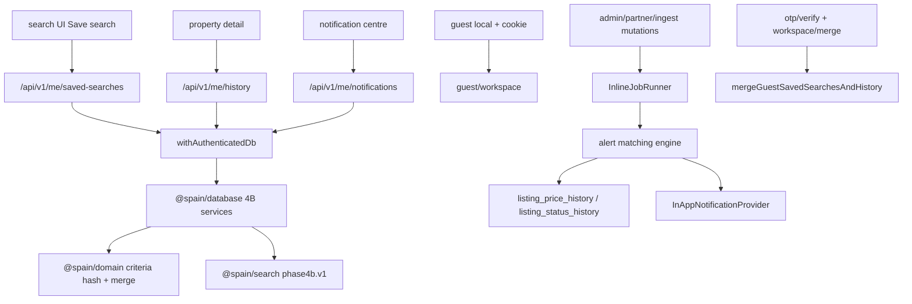

# Phase 4B plan — Saved searches, browsing history, and in-app alerts

Date: 2026-08-06  
Status: **Planning complete** (implementation not started)  
ADR: [`ADR-030b`](DECISIONS.md) · Parent: [`PHASE4_PLAN.md`](PHASE4_PLAN.md) · Builds on: [`PHASE4A_IMPLEMENTATION.md`](PHASE4A_IMPLEMENTATION.md)

## Objective

Allow buyers to preserve property searches, review recently viewed properties, and receive reliable **in-app** notifications when relevant listing changes occur—without production email/SMS/WhatsApp/push.

## Scope lock

**In:**

1. Saved searches (CRUD, alerts prefs, manual run, match counts, evaluation timestamps, versioned criteria)
2. Guest saved searches + transactional idempotent merge
3. Browsing history (record, list, clear one/all, retention, guest merge)
4. In-app notification centre
5. Alert matching engine + price/status event derivation
6. Provider-neutral jobs (`InlineJobRunner` / `TestJobRunner`) and notifications (`InApp` / `Test`)
7. Privacy, RLS, APIs, UI (en/es/ca/ar + RTL), tests, docs

**Out (4C / later):** comparison share links, collaborators, leads, production email/SMS/WhatsApp/push, AI, maps, JSON/XML, scraping, agency access to buyer activity, pg-boss.

**Supersedes** prior status text that placed in-app alerts under Phase 4C. Phase **4C** = comparison share links only.

---

## Architecture



Copy auth/CSRF patterns from Phase 4A `/api/v1/me/*` and guest cookie from ADR-030a.

---

## Feature 1 — Saved searches

### Database

See [`PHASE4B_DATABASE_CHANGES.md`](PHASE4B_DATABASE_CHANGES.md): table `saved_searches` with versioned `criteria` jsonb, `criteria_hash`, alert columns, evaluation metadata; `saved_search_evaluation_runs`; `saved_search_last_matches` for new-vs-changed match diffs.

### Domain rules

- Criteria envelope `criteriaVersion: 'phase4b.v1'` — [`SAVED_SEARCH_CRITERIA_SPEC.md`](SAVED_SEARCH_CRITERIA_SPEC.md)
- Persist **normalized versioned JSON** plus **selected indexed columns** (D15); JSON is source of truth
- `normalizeCriteria` + `hashCriteria` (stable key order); unique `(user_id, criteria_hash)`
- Caps: **25** auth / **5** guest
- Enabling alerts requires explicit opt-in (`alerts_enabled` + `alert_types[]` + `consented_at`)
- Default alert types on enable: `new_match` + `price_reduction` enabled; `price_increase` available but **off** (D16)
- Manual run updates `last_evaluated_at`, `last_match_count`, evaluation run row; does not invent listings
- Automated due-scan deferred; provider-neutral scheduler interface only (D14)

### Services / API

| Service                                                         | Behaviour                                                                                                  |
| --------------------------------------------------------------- | ---------------------------------------------------------------------------------------------------------- |
| `createSavedSearch` / `updateSavedSearch` / `deleteSavedSearch` | Owner-only; cascade evaluation runs + last matches + related notifications optional archive                |
| `listSavedSearches`                                             | Newest updated first                                                                                       |
| `runSavedSearch`                                                | Execute `searchProperties` with stored criteria; record run; return count + optional listing ids (bounded) |
| `enableSavedSearchAlerts` / `disableSavedSearchAlerts`          | Toggle prefs; disable does not delete notifications                                                        |

Routes: `GET/POST /api/v1/me/saved-searches`, `PATCH/DELETE /api/v1/me/saved-searches/[id]`, `POST .../[id]/run`, `PATCH .../[id]/alerts`. Session + CSRF on mutations + Zod + `withAppAuthenticatedDb`. Never trust body `userId`.

### UI

- `/{locale}/workspace/searches`, `/{locale}/workspace/searches/[id]`
- `SaveSearchDialog` on search page; `SavedSearchList`, `SavedSearchDetail`, `AlertPreferenceControls`
- Show latest match count + last evaluated; empty/loading/error states
- i18n en/es/ca/ar + RTL

### Guest / authenticated

| Actor | Behaviour                                                                                 |
| ----- | ----------------------------------------------------------------------------------------- |
| Guest | Local + `guest_sessions.payload` typed saved-search objects (cap 5); UI “Sign in to sync” |
| Auth  | DB rows; alerts only when enabled                                                         |

### Authorization / RLS / privacy

Owner RLS only; no agency SELECT. Criteria and alert prefs never appear in partner/admin/public APIs. Account deletion CASCADE. Export implications documented for Phase 4.1+.

### Tests / acceptance

Criteria validation, versioning, hash stability, duplicate hash reject, caps, RLS cross-user deny. Acceptance: [`PHASE4B_ACCEPTANCE_CRITERIA.md`](PHASE4B_ACCEPTANCE_CRITERIA.md).

---

## Feature 2 — Guest saved-search merge

### Domain rules (extend `mergeGuestWorkspace`)

- Prepend guest searches; skip when `criteria_hash` already exists for user (**never overwrite** auth row)
- Name clash on insert → `Guest — {name}`
- Guest disabled / alerts off → do not flip auth `alerts_enabled`
- Guest alert prefs apply **only** on newly inserted rows
- Truncate to 25 after merge
- Repeated OTP/merge: idempotent via `merged_at`

### Services

`mergeGuestSavedSearchesAndHistory` inside existing `mergeGuestWorkspaceIntoUser` transaction (same OTP verify + `POST /me/workspace/merge` triggers).

### Tests

Duplicate criteria, identical names, existing auth searches, repeated callbacks, alert prefs, disabled searches.

---

## Feature 3 — Browsing history

Full design: [`BROWSING_HISTORY_DESIGN.md`](BROWSING_HISTORY_DESIGN.md).

### Database

Table `browsing_history`: `user_id`, `listing_id`, optional `physical_property_id`, `first_viewed_at`, `last_viewed_at`, `view_count`, `channel`, optional `context` jsonb; `UNIQUE(user_id, listing_id)`.

### Domain / services

| Service                                      | Behaviour                                                                 |
| -------------------------------------------- | ------------------------------------------------------------------------- |
| `recordPropertyView`                         | Upsert; increment count; refresh last viewed; no-op if recording disabled |
| `listRecentlyViewed`                         | Cap 50; prune expired on read                                             |
| `removeHistoryItem` / `clearBrowsingHistory` | Owner-only                                                                |
| `expireOldHistory`                           | Job: delete rows older than retention                                     |

### API / UI

- `POST /api/v1/me/history/views`, `GET/DELETE /api/v1/me/history`, `DELETE /api/v1/me/history/[listingId]`
- Auto-record on property detail when enabled
- `/{locale}/workspace/history` · `HistoryList`

### Guest / merge

Guest: local + guest payload richer history entries. Merge: upsert by listing; min(first), max(last), sum(count); cap 50.

### Privacy

Never exposed to agencies, sources, or public comparison links. `history_recording_enabled` on `notification_preferences`. Retention **90 days** (user-clearable anytime via clear one/all). Account deletion CASCADE.

### Tests

Retention, ownership, clear one/all, agency deny, merge upsert.

---

## Feature 4 — In-app notification centre

Full design: [`IN_APP_NOTIFICATION_DESIGN.md`](IN_APP_NOTIFICATION_DESIGN.md).

### Types

`new_match`, `price_reduction`, `price_increase`, `status_reserved`, `status_under_offer`, `listing_withdrawn`, `listing_stale`, `saved_property_updated`, `saved_search_evaluation_failed`.

### Services / API

`listNotifications`, `markNotificationRead`, `markAllNotificationsRead`, `dismissNotification`  
Routes: `GET /api/v1/me/notifications`, `POST .../[id]/read`, `POST .../read-all`, `POST .../[id]/dismiss`.

### UI

`/{locale}/workspace/notifications`, header `UnreadBadge`, deep links to property or saved search; localized title/body keys; duplicate suppression via `dedupe_key`.

### Providers

`NotificationProvider` → `InAppNotificationProvider`, `TestNotificationProvider` only.

---

## Feature 5 — Alert matching engine

Full design: [`ALERT_MATCHING_ENGINE.md`](ALERT_MATCHING_ENGINE.md).

- Deterministic `matchesListing(criteria, listingFacts)`
- Only public-browseable authorized listings; **legacy snapshot alerts disabled** (test flag only)
- Diff against `saved_search_last_matches` for **new** vs previously matched
- Record evaluation runs + failures; retry-safe / idempotent via `dedupe_key` + unique constraints
- **4B evaluation triggers:** manual run + test harness; optional inline mutation hooks for price/status fan-out; **no** production scheduler—`evaluateAllDueSavedSearches` is the future automation seam
- Status/withdrawal alerts for **shortlisted** listings or saved-search last matches (D17)
- Price reductions on by default for alert-enabled searches; price increases opt-in (D16)

---

## Feature 6 — Price and status events

- Emit from new `listing_price_history` / `listing_status_history` rows at admin/partner/ingest mutation sites
- `source_event_id` = history row UUID → one notification per user per source event
- Withdrawn / stale / reappear / multi-listing same physical property: listing-scoped + UTC-day sibling suppression (D13)

---

## Feature 7 — Job execution

Provider-neutral `JobRunner`:

| Method                               | Purpose                                                                  |
| ------------------------------------ | ------------------------------------------------------------------------ |
| `evaluateSavedSearch`                | One search (manual / test)                                               |
| `evaluateAllDueSavedSearches`        | Batch due/enabled — **scheduler seam**; tests in 4B, not production cron |
| `generateListingChangeNotifications` | Fan-out from a listing price/status event                                |
| `expireOldHistory`                   | Retention prune                                                          |
| `cleanExpiredNotifications`          | Optional archive purge                                                   |

Implementations: `InlineJobRunner`, `TestJobRunner`. No pg-boss/Inngest/Trigger.dev in 4B. Document a provider-neutral `Scheduler` interface that may later invoke `evaluateAllDueSavedSearches` without changing job method signatures.

---

## Feature 8 — Notification provider boundary

```typescript
interface NotificationProvider {
  deliver(input: NotificationDeliveryInput): Promise<NotificationDeliveryResult>;
}
```

- `InAppNotificationProvider` — writes `in_app_notifications` + `notification_deliveries`
- `TestNotificationProvider` — in-memory / capture for tests
- Documented stubs only: Email, SMS, WhatsApp, Push

---

## Feature 9 — Privacy

Documented in plan + security review:

- Retention, clear-history, account deletion CASCADE
- Saved-search / notification delete or archive
- Guest identity expiry (existing guest_sessions TTL)
- Data export implications (4.1+)
- Minimal notification payloads (ids + type keys, not PII dumps)
- Exclusion from agency analytics / unauthorized profiling

---

## Feature 10 — Authorization and RLS

| Table                               | Owner            | Agency | Jobs                  |
| ----------------------------------- | ---------------- | ------ | --------------------- |
| `saved_searches` (+ children)       | CRUD self        | deny   | service-role evaluate |
| `browsing_history`                  | CRUD self        | deny   | service-role expire   |
| `in_app_notifications` / deliveries | read/update self | deny   | service-role insert   |
| Guest payload                       | cookie hash      | deny   | —                     |

Cross-user read/update/delete denied. Post-merge ownership = authenticated user. Admin support: no ad-hoc SELECT in 4B (support tooling deferred).

---

## Feature 11 — Implementation order (when approved)

1. Extend `@spain/search` criteria + hash helpers + unit tests
2. Migrations `0009` / `0010` + Drizzle schema + RLS catalogue
3. Services: saved searches, history, notifications, matching, jobs/providers
4. Extend guest merge transaction
5. API routes + OTP merge wiring
6. Inline hooks on listing mutations
7. UI + i18n
8. Integration / Playwright
9. Status/matrix updates to **implemented** only for shipped policies

---

## Companion docs

| Doc                                                                | Role               |
| ------------------------------------------------------------------ | ------------------ |
| [`SAVED_SEARCH_CRITERIA_SPEC.md`](SAVED_SEARCH_CRITERIA_SPEC.md)   | Versioned criteria |
| [`BROWSING_HISTORY_DESIGN.md`](BROWSING_HISTORY_DESIGN.md)         | History            |
| [`IN_APP_NOTIFICATION_DESIGN.md`](IN_APP_NOTIFICATION_DESIGN.md)   | Notifications      |
| [`ALERT_MATCHING_ENGINE.md`](ALERT_MATCHING_ENGINE.md)             | Matching           |
| [`PHASE4B_DATABASE_CHANGES.md`](PHASE4B_DATABASE_CHANGES.md)       | Schema             |
| [`PHASE4B_SECURITY_REVIEW.md`](PHASE4B_SECURITY_REVIEW.md)         | Threats            |
| [`PHASE4B_ACCEPTANCE_CRITERIA.md`](PHASE4B_ACCEPTANCE_CRITERIA.md) | Gates              |
| [`PHASE4B_DECISIONS_REQUIRED.md`](PHASE4B_DECISIONS_REQUIRED.md)   | Locks              |

## Explicit non-goals

Production email/SMS/WhatsApp/push; browser push; AI; share links; collaborators; leads; agency analytics on buyer activity; JSON/XML; scraping; geospatial enrichment; pg-boss.
