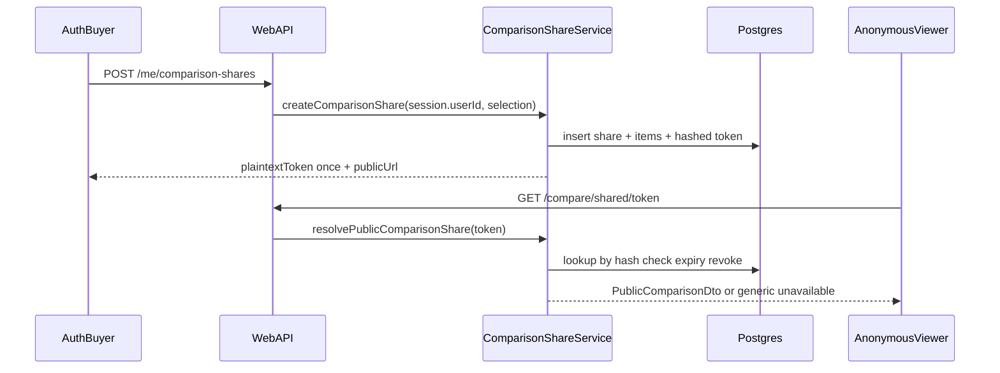

# Phase 4C plan — Secure, expiring, revocable property comparison sharing

Date: 2026-08-06  
Status: Phase 4C planning (not implemented)  
ADR: [`ADR-030c`](DECISIONS.md) · Parent: [`PHASE4_PLAN.md`](PHASE4_PLAN.md) · Builds on: [`PHASE4A_IMPLEMENTATION.md`](PHASE4A_IMPLEMENTATION.md)

## Objective

Allow an authenticated buyer to create a secure, read-only public comparison link containing only deliberately selected properties and explicitly approved public fields. Recipients do not need an account.

## Scope lock

**In:**

1. Share creation and management (select properties, title/description, expiry, copy link, list, revoke, replace)
2. Cryptographically secure tokens (hash-at-rest, revocable, expiring)
3. Versioned share manifest + explicit share-item selection
4. Public comparison DTO allowlist
5. Listing-change warnings on the public page
6. Localized public route + owner UI
7. Privacy-minimal access aggregates
8. Rate limiting / enumeration resistance
9. AuthZ, RLS, tests, docs

**Out:** collaborative editing, recipient comments/accounts, searchable public comparisons, permanent links, lead capture, email/SMS/WhatsApp, AI, voice, maps, Phase 5+.

**Preserve:** 4A notes never shared; 4B history/searches/notifications never shared; ADR-029 sessions; no agency visibility into buyer shares.

## Architecture

## Feature 1 — Share creation and management

### Behaviour

Owner may:

- select 2–5 properties to share
- set optional public title and neutral public description
- choose expiry: 24h / 7d / 30d / custom date (≤ 90 days); default **7 days**
- create share link and copy it
- list active, expired, and revoked shares
- revoke a share
- replace a share (new token; old revoked; `replaced_by_share_id`)
- see created_at, expires_at, status, property count

Permanent links are disabled.

### Database

See [`PHASE4C_DATABASE_CHANGES.md`](PHASE4C_DATABASE_CHANGES.md): `comparison_shares`, `comparison_share_items`.

### Domain / service

- Validate listing count (2–5), expiry window, title/description length.
- Mint token; store hash only.
- Persist explicit items — do not rely on live shortlist membership.

### API

| Method | Path | Auth |
| ------ | ---- | ---- |
| POST   | `/api/v1/me/comparison-shares` | Session + CSRF |
| GET    | `/api/v1/me/comparison-shares` | Session |
| GET    | `/api/v1/me/comparison-shares/{id}` | Session |
| POST   | `/api/v1/me/comparison-shares/{id}/revoke` | Session + CSRF |
| POST   | `/api/v1/me/comparison-shares/{id}/replace` | Session + CSRF |

### UI

Share dialog on `/{locale}/workspace/compare`: property selection, expiry, score/weight toggles (default off), copy link; owner share list with revoke/replace.

### Acceptance

Owner can create a 7-day share, copy the URL, list it as active, revoke it, and replace it with a new token.

---

## Feature 2 — Secure token model

See [`COMPARISON_SHARE_SECURITY_MODEL.md`](COMPARISON_SHARE_SECURITY_MODEL.md).

- ≥ 256-bit CSPRNG; base64url plaintext
- SHA-256 hash stored; plaintext never in DB or logs
- Unguessable; not derived from IDs
- Invalid after expiry, revoke, or delete
- Constant-time hash compare

Public URL: `/{locale}/shared-comparison/{token}` — no sequential internal IDs.

---

## Feature 3 — Share snapshot and manifest

Manifest schema version **`phase4c.v1`** (jsonb on `comparison_shares.manifest`).

| Captured at create | Resolved live at open |
| ------------------ | --------------------- |
| Selected listing IDs + positions | Current public price/status/freshness/images/attribution for those IDs |
| Allowed public field keys | Mapped through PublicComparisonDto only |
| include_weights / include_scores | Frozen weight/score snapshots if enabled |
| score_model_version (`phase4a.v1`) | — |
| public title/description | — |
| created_at / expires_at | — |
| optional physical_property_id per item | Warning if listing merged/withdrawn |

Future private workspace changes must not add properties or fields to an existing share.

---

## Feature 4 — Public DTO allowlist

See [`PUBLIC_COMPARISON_DTO.md`](PUBLIC_COMPARISON_DTO.md).

Dedicated mapper — never serialize ORM entities. Notes, identity, history, searches, notifications, exact addresses, unauthorized images always excluded.

---

## Feature 5 — Property changes after sharing

| Event | Public page behaviour |
| ----- | --------------------- |
| Price change | Show live price; optional “price updated” cue |
| Reserved / under offer / withdrawn | Status warning on that slot |
| Stale | Freshness warning |
| Deleted / not browseable | Slot unavailable warning; keep position |
| Image authorization lost | No image / placeholder; never unauthorized binary |
| Physical-property merge | Warning; **never** auto-swap to sibling listing |
| Replaced by another agency listing | Warning; keep original listing id slot |

Silent substitution of another property is forbidden.

---

## Feature 6 — Public route

- Page: `/{locale}/shared-comparison/[token]`
- API: `GET /api/v1/compare/shared/{token}`
- Read-only; no auth; en/es/ca/ar + Arabic RTL
- `noindex`; `Cache-Control: private, no-store` (or equivalent); `Referrer-Policy: no-referrer` (or strict-origin-when-cross-origin documented)
- Social preview: same DTO or generic unavailable
- Invalid / expired / revoked → identical generic unavailable (no existence leak)

---

## Feature 7 — Privacy-preserving access records

- Aggregates: `access_count`, `last_accessed_at`
- Optional events: share_id, accessed_at, result, ua_category
- No recipient identity or full IP exposed to buyer
- Truncated/hashed network id deferred (D23)

---

## Feature 8 — Rate limiting and abuse

| Action | Limit |
| ------ | ----- |
| Public resolve | 60/min/IP |
| Create/replace | 10/min/user |

Enumeration resistance: generic responses; hash lookup only; never log full tokens.

---

## Feature 9–10 — Auth and RLS

- Owner CRUD: verified session + `user_id` claim; body must not supply owner id.
- Agency/admin: no ad-hoc SELECT on share tables in 4C.
- Anon: no RLS SELECT; resolve via service-role after rate limit (D24).

---

## Feature 11 — Services

| Function | Role |
| -------- | ---- |
| `createComparisonShare` | Validate; mint; hash; insert |
| `listComparisonShares` | Owner list by status |
| `getComparisonShareForOwner` | Metadata (no plaintext token) |
| `revokeComparisonShare` | Set `revoked_at` |
| `replaceComparisonShare` | Revoke + create; link replacement |
| `resolvePublicComparisonShare` | Hash resolve → PublicComparisonDto |
| `recordShareAccess` | Aggregates + optional event |

Validate all inputs at API/service boundaries.

---

## Feature 12 — UI summary

**Owner:** create-share dialog, selection, expiry, field/score options, copy link, share list, revoke confirm, replace.

**Public:** title/description, matrix, optional frozen scores, warnings, attribution, mobile layout, unavailable state, RTL.

---

## Feature 13 — Tests

Unit: token gen/hash; allowlist exclusions; expiry/revoke/replace; listing warnings.  
Integration/RLS: owner isolation; agency deny; no anon table SELECT.  
Playwright (required):

authenticated buyer → open comparison → select two properties → create 7-day share → copy link → anonymous context opens link → only approved public info → no private notes/identity → owner revokes → anonymous sees generic unavailable.

---

## Documentation map

| Doc | Role |
| --- | ---- |
| [`COMPARISON_SHARE_SECURITY_MODEL.md`](COMPARISON_SHARE_SECURITY_MODEL.md) | Tokens / abuse |
| [`PUBLIC_COMPARISON_DTO.md`](PUBLIC_COMPARISON_DTO.md) | Allowlist / snapshot vs live |
| [`PHASE4C_DATABASE_CHANGES.md`](PHASE4C_DATABASE_CHANGES.md) | Schema / RLS |
| [`PHASE4C_SECURITY_REVIEW.md`](PHASE4C_SECURITY_REVIEW.md) | Threats |
| [`PHASE4C_ACCEPTANCE_CRITERIA.md`](PHASE4C_ACCEPTANCE_CRITERIA.md) | Gates |
| [`PHASE4C_DECISIONS_REQUIRED.md`](PHASE4C_DECISIONS_REQUIRED.md) | Locks |

## Implementation status

**Planning complete. Application code not started.**
