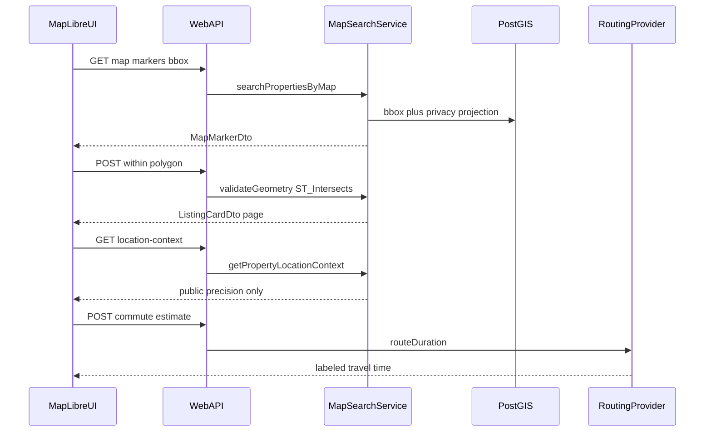

# Phase 5 plan — Map Search and Geospatial Intelligence

Date: 2026-08-07  
Status: Phase 5 planning (not implemented)  
ADR: [`ADR-031`](DECISIONS.md) · Locks: [`PHASE5_DECISIONS_REQUIRED.md`](PHASE5_DECISIONS_REQUIRED.md)

## Objective

Create a reliable, privacy-aware, and performant map-based property discovery system for Spain, with geographic filtering, nearby-place intelligence, environmental classifications, and travel-time search.

## Scope lock

**In:** geographic hierarchy; property coordinates with provenance; location privacy projection; MapLibre GL JS map/list UX; geographic filters + draw-area; environmental classifications; amenities/transit; distance semantics; private commute profiles; routing/geocoding provider abstraction; geocoding workflow; enrichment pipeline; typed search services; performance; security/RLS; controlled canonical map URLs for SEO; tests; docs.

**Technical locks (ADR-031):** PostgreSQL + PostGIS; store `geometry` SRID 4326 with GiST indexes; metre calcs via `geography`; minimal `MapMarkerDto`; drawn areas = versioned GeoJSON + validated PostGIS geometry; public coordinates approximate unless exact publication authorized; never invent legacy coords; provider-neutral routing with mocked local/test providers; commute destinations private (encrypted or access-restricted); classifications calculated / explainable / versioned; no search-engine indexing of unlimited geometry variants.

**Out:** AI chat, legal AI, WhatsApp, voice, telephone calls, mortgages, production crawling, unlicensed map/place data, nationwide one-shot enrichment, automatic valuation, collaborative buyer workspaces, Phase 6+.

**Preserve:** ADR-016 PostGIS; ADR-017 provider isolation; ADR-029 sessions; Phase 4B saved searches (extend via `phase5.v1`); Phase 4C public DTO never leaks exact/hidden coordinates; Alcaraz under Castilla-La Mancha → Albacete.

## Current baseline

- PostGIS extension installed; **no** geometry columns or `ST_*` queries yet.
- Partial hierarchy seed (Catalonia + Alcaraz); numeric lat/lng on `property_locations` for partner CSV only.
- Public search is text/`ILIKE` + cards/table; map view deferred ([`KNOWN_ISSUES.md`](KNOWN_ISSUES.md) #6).
- 60 legacy browseable listings have **no** coordinates — must not invent them.

## Architecture



## Feature map

### 1. Geographic hierarchy

Spain → autonomous community → province → comarca (where applicable) → municipality → district → neighborhood/locality → postal code → development/building.

- Official codes where available; multilingual aliases (es/ca/en + others as needed).
- Boundary + centroid geometries; source and version on every geo dataset row.
- Free-text names are **aliases**, never the sole key.
- Spec: [`GEOSPATIAL_DATA_MODEL.md`](GEOSPATIAL_DATA_MODEL.md).

### 2. Property coordinates

Store exact, approximate, advertiser-provided, geocoded, and manually verified coordinates with confidence, source, precision category, and `last_verified_at`.

- Do **not** invent coordinates.
- No reliable coords → searchable via administrative geography only; **not** shown as a false exact pin.

### 3. Location privacy

Visibility: `exact` | `building_approximate` | `street_approximate` | `neighborhood_centroid` | `municipality_centroid` | `hidden`.

Public map and APIs use projected coordinates only. Never leak hidden exact coords via APIs, SSR, client state, map payloads, Phase 4C shares, or future AI tools.

Spec: [`LOCATION_PRIVACY_MODEL.md`](LOCATION_PRIVACY_MODEL.md).

### 4. Map interface (MapLibre)

- Map ↔ list synchronization (card select ↔ marker select)
- Clustering; viewport search; “search this area”; zoom/pan
- Responsive split view; full-screen mobile map
- Accessible non-map list/card/table alternative always available
- Loading and error states; user-controlled map/list/table views

Spec: [`MAP_SEARCH_ARCHITECTURE.md`](MAP_SEARCH_ARCHITECTURE.md).

### 5. Geographic filters

Autonomous community, province, municipality, district, neighborhood/locality, postal code, radius, map viewport, drawn polygon/rectangle, travel-time zone when available.

Serializable into saved searches as **`phase5.v1`** spatial envelope.

### 6. Draw-your-area

Draw / edit / clear polygon; combine with ordinary filters; save and reopen.

Persistence: **versioned GeoJSON** in saved-search criteria **plus** validated PostGIS `geometry(...,4326)` at query time.

Validation: coordinate order, valid polygon, no self-intersection, max **100** vertices, ~**50 km** extent, Spain bounds — PostGIS.

### 7. Environmental classifications

Coastal, beachfront, sea view (advertiser-declared only), near beach, mountain, hillside, mountain-top, valley, river, lake, forest, rural, village, town, urban centre, marina, golf, island, protected-natural-area proximity.

Each row is **calculated** (or declared), **explainable**, and **versioned**: value, source, method, distance/threshold, confidence, calculated date, algorithm version, explanation key.

Spec: [`ENVIRONMENT_CLASSIFICATION_SPEC.md`](ENVIRONMENT_CLASSIFICATION_SPEC.md).

### 8–9. Amenities and distance

Transit (metro, FGC, Rodalies, rail, bus, airport) and amenities (hospital, health centre, school, university, supermarket, park, beach, marina, golf, town centre).

Store points as `geometry` 4326; **metre** straight-line / nearest via PostGIS **geography**. Routed walking/driving/transit times **only** via provider-neutral adapter (mocked local/test) and correctly labeled.

Spec: [`AMENITY_AND_TRANSIT_MODEL.md`](AMENITY_AND_TRANSIT_MODEL.md).

### 10. Commute profiles

Private destinations (workplace, school, family, airport, city centre, custom): label, precision, mode, max time, departure context, guest merge. Destinations are **encrypted or access-restricted**; agencies: **deny**.

### 11–12. Routing abstraction and geocoding

Provider-neutral ports for geocode, reverse geocode, route distance/duration, matrix, isochrone. **Mocked** Fake/Test adapters for local and CI. Server-side keys; cache; rate limits; attribution; retention limits.

Geocoding: normalize → queue → confidence gate → quarantine ambiguous → manual review → publish. No auto-publish of low-confidence pins; **never invent** missing legacy coordinates.

Spec: [`ROUTING_PROVIDER_INTERFACE.md`](ROUTING_PROVIDER_INTERFACE.md).

### 13. Enrichment pipeline

coordinates → administrative assignment → environmental classification → nearby places → transit proximity → optional routing enrichment → quality review → publication.

All calculated values carry provenance + algorithm version.

### 14. Live vs legacy

Distinguish: live authorized, manually verified, legacy snapshot, approximate-location. Legacy without reliable coords: admin-geo search only.

### 15. Typed services

| Service | Role |
| ------- | ---- |
| `searchPropertiesByMap` | Viewport + filters → markers/cards |
| `searchPropertiesWithinGeometry` | Polygon/rectangle PIP |
| `searchPropertiesNearPoint` | Radius |
| `getMapClusters` | Server or client-assist clusters |
| `getPropertyLocationContext` | Public location panel |
| `getNearbyAmenities` / `getDistanceToAmenity` | Proximity |
| `getCommuteEstimate` | Provider travel time |
| `saveGeographicSearch` | Persist `phase5.v1` |
| `enrichPropertyGeography` | Pipeline step |
| `resolveAdministrativeAreas` | Hierarchy resolve |
| `projectPublicLocation` | Privacy projection (mandatory) |

Frontend never queries spatial tables directly.

### 16. Performance targets (planning)

| Operation | Target (warm p95) |
| --------- | ----------------- |
| Initial map markers | &lt; 1.5 s |
| Cluster refresh after pan (300 ms debounce) | &lt; 800 ms |
| Property location context | &lt; 1 s |

GiST indexes on `geometry` 4326; metre calcs via geography; bbox prefilter; minimal marker DTO ≠ card DTO; cancel in-flight on move; simplify large polygons.

### 17–18. Security and RLS

Geometry size/rate limits; no provider keys in client; no exact coords when forbidden (public default approximate unless exact authorized); owner RLS + encryption/access-restriction on commute destinations and private saved spatial criteria; public projected views only; controlled canonical map URLs / `noindex` freeform geometry.

### 19. UI routes (planned)

- `/{locale}/search` — map/list/table modes
- Map fullscreen mobile
- Draw tools, hierarchy selector, nearby/transport panels, commute editor, travel-time filter, location confidence / disclosure, classification explanation
- Locales: en / es / ca / ar (+ RTL)

### 20. Tests

Unit: PIP, radius, boundary assign, precision projection, leakage, polygon validation, env class, distance labels, provider adapters, cache.  
Integration/RLS: commute isolation, agency deny, anon no exact when approximate.  
Playwright (required): Barcelona search → map → search this area → draw polygon → coastal/near-beach filter → select property → nearby transit/amenities → commute destination → max commute filter → save search → sign out/in → criteria + commute persist. Mocked providers.

## APIs (planned)

```text
GET  /api/v1/geography/search
GET  /api/v1/geography/areas/{id}
GET  /api/v1/properties/map          # markers / clusters (projected)
POST /api/v1/properties/within       # polygon / rectangle body
GET  /api/v1/properties/{id}/location-context
GET  /api/v1/properties/{id}/nearby
POST /api/v1/me/commute-destinations
GET  /api/v1/me/commute-destinations
POST /api/v1/me/commute/estimate
# saved searches continue under /api/v1/me/saved-searches with phase5.v1 criteria
```

## Jobs

Barcelona enrichment may run inline or via scheduler seam (ADR-027). Durable queue deferred.

## First vertical slice (implementation later)

1. Barcelona published markers (real coords only)
2. Map/list synchronization
3. Viewport / “search this area”
4. One drawn polygon
5. Nearby transit + beach/park **straight-line** distances
6. Location privacy projection
7. Save geographic search (`phase5.v1`)

Commute editor may ship in slice **5B** if 5A needs to stay thin.

## Documentation map

| Doc | Role |
| --- | ---- |
| [`GEOSPATIAL_DATA_MODEL.md`](GEOSPATIAL_DATA_MODEL.md) | Hierarchy / geometries |
| [`MAP_SEARCH_ARCHITECTURE.md`](MAP_SEARCH_ARCHITECTURE.md) | MapLibre / services / perf |
| [`LOCATION_PRIVACY_MODEL.md`](LOCATION_PRIVACY_MODEL.md) | Display projection |
| [`ENVIRONMENT_CLASSIFICATION_SPEC.md`](ENVIRONMENT_CLASSIFICATION_SPEC.md) | Classifications |
| [`AMENITY_AND_TRANSIT_MODEL.md`](AMENITY_AND_TRANSIT_MODEL.md) | Places / transit |
| [`ROUTING_PROVIDER_INTERFACE.md`](ROUTING_PROVIDER_INTERFACE.md) | Providers |
| [`PHASE5_DATABASE_CHANGES.md`](PHASE5_DATABASE_CHANGES.md) | Schema / RLS |
| [`PHASE5_SECURITY_REVIEW.md`](PHASE5_SECURITY_REVIEW.md) | Threats |
| [`PHASE5_ACCEPTANCE_CRITERIA.md`](PHASE5_ACCEPTANCE_CRITERIA.md) | Gates |
| [`PHASE5_DECISIONS_REQUIRED.md`](PHASE5_DECISIONS_REQUIRED.md) | Locks |

## Implementation status

**Planning complete. Application code not started.**
