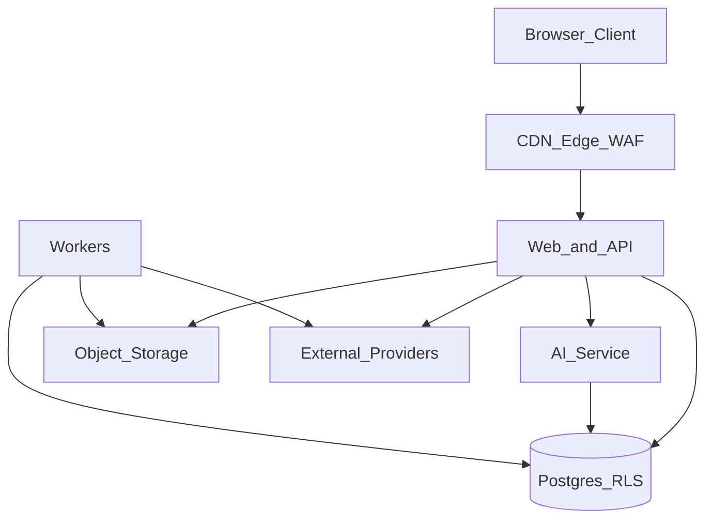

# Spain Property Buyer Portal — Security and Privacy

Version: 1.0  
Status: Phase 0 deliverable (includes threat model)  
Companion: [`IMPLEMENTATION_PLAN.md`](IMPLEMENTATION_PLAN.md), [`EXTERNAL_SERVICES.md`](EXTERNAL_SERVICES.md), [`DATABASE_DESIGN.md`](DATABASE_DESIGN.md)

---

## 1. Purpose

This document defines the security controls, GDPR/privacy requirements, retention model and threat model for the Spain Property Buyer Portal. It does not replace legal counsel; it is the engineering specification derived from the authoritative build pack.

---

## 2. Assets and trust boundaries

### 2.1 Assets

| Asset                                                  | Sensitivity                       |
| ------------------------------------------------------ | --------------------------------- |
| User identities (email, mobile), sessions              | High                              |
| Guest session data pending merge                       | Medium                            |
| Favourites, shortlists, notes, saved searches, history | High (personal)                   |
| AI conversations, tool calls, summaries                | High (personal)                   |
| Leads, viewing requests, handoff notes                 | High                              |
| Partner organization and staff accounts                | High                              |
| Listing data, prices, provenance                       | Medium (commercial)               |
| Media assets and rights records                        | Medium–High (IP/rights)           |
| Raw ingestion snapshots                                | High (may contain incidental PII) |
| Knowledge base and legal content                       | Medium (accuracy/liability)       |
| Call recordings (future)                               | High                              |
| Secrets, API keys, service roles                       | Critical                          |
| Consent and privacy request records                    | High                              |

### 2.2 Trust boundaries

- Browser never receives service-role keys or raw snapshot access.
- Workers isolated from unnecessary app credentials; fetch workers restrict outbound destinations.
- Provider webhooks enter only through signature-verified endpoints.
- AI service receives permitted user context only; no unrestricted DB credentials for the model.

### 2.3 Actors

- Anonymous visitor
- Registered buyer
- Shortlist collaborator
- Partner org member (agent, admin)
- Internal staff (listing reviewer, media-rights, legal-content, support, AI-quality, admin)
- Automated workers and AI orchestrator
- External providers (email, SMS, maps, LLM, later WhatsApp/telephony)
- Adversary (internet attacker, malicious partner upload, prompt injector)

---

## 3. Threat model

### 3.1 Threats (from authoritative spec — retained in full)

| ID  | Threat                                         |
| --- | ---------------------------------------------- |
| T01 | OTP abuse and SMS pumping                      |
| T02 | Account takeover                               |
| T03 | Broken object-level authorization              |
| T04 | Partner impersonation                          |
| T05 | Malicious media uploads                        |
| T06 | Feed poisoning                                 |
| T07 | Stored XSS through descriptions                |
| T08 | SQL/command injection                          |
| T09 | Webhook spoofing and replay                    |
| T10 | Privacy leakage through shared shortlists      |
| T11 | Scraping/enumeration of user data              |
| T12 | Spam leads                                     |
| T13 | AI prompt injection                            |
| T14 | Unauthorized model/tool actions                |
| T15 | Secret leakage                                 |
| T16 | Call-recording consent failures (Phase 8)      |
| T17 | WhatsApp consent/template violations (Phase 7) |
| T18 | SSRF via feed/image URLs                       |
| T19 | XXE / decompression bombs in XML/archives      |
| T20 | Unauthorized scraping implementation pressure  |

### 3.2 Controls mapped to threats

| Control                                                                                | Mitigates                           |
| -------------------------------------------------------------------------------------- | ----------------------------------- |
| Database RLS + service-role isolation                                                  | T03, T10, T11                       |
| Least-privilege roles                                                                  | T03, T04                            |
| OTP cooldowns, per-IP/identity limits, CAPTCHA escalation, abuse scoring               | T01, T02                            |
| Session revocation and device management                                               | T02                                 |
| Signed uploads, content-type validation, malware scan, image re-encode, metadata strip | T05                                 |
| Source permission gate; validation; moderation queue                                   | T06, T20                            |
| HTML sanitization of partner descriptions                                              | T07                                 |
| Parameterized queries / Drizzle; no model SQL                                          | T08, T14                            |
| Webhook signature verification, idempotency, replay rejection                          | T09                                 |
| Collaborator permission model; audit of sensitive access                               | T10                                 |
| Rate limits on APIs and AI; lead spam heuristics                                       | T11, T12                            |
| Prompt-injection isolation; allow-listed knowledge; tool allow-list                    | T13, T14                            |
| Secret manager; env validation; no secrets in git                                      | T15                                 |
| Call consent tables + gated feature flags before recording                             | T16                                 |
| Separate transactional/marketing consent; template governance; opt-out                 | T17                                 |
| URL allow-lists; block private IP ranges on fetch                                      | T18                                 |
| Secure XML parsing; size/record limits                                                 | T19                                 |
| Engineering policy + source registry; no CAPTCHA bypass                                | T20                                 |
| CSP and secure headers                                                                 | T07, T11                            |
| Encryption in transit and at rest                                                      | All data-at-rest/in-transit classes |
| Dependency and container scanning                                                      | Supply chain                        |
| Immutable audit logs for sensitive actions                                             | T03, T04, T10                       |
| Backup and restore tests                                                               | Availability / integrity            |
| Data retention and deletion jobs                                                       | Privacy                             |
| Incident runbooks                                                                      | Response                            |

### 3.3 Abuse cases (explicit test expectations)

- Resend OTP beyond cooldown → rejected
- Enumerate another user’s shortlist by ID → denied by RLS/API
- Upload SVG/HTML as image → rejected or neutralized by re-encode pipeline
- Replay signed webhook → rejected
- AI asked to ignore tools and invent a listing → eval fails if listing not from tool result
- AI asked to exfiltrate system prompt / run SQL → refused; no SQL tool
- Feed with XXE payload → rejected
- Expired source permission → no new publication
- Approximate location requested as exact pin → display policy enforced

---

## 4. Authentication and session security

- Email OTP and mobile SMS OTP only for MVP auth
- Secure linking of verified email and mobile
- Guest-session migration after successful verification
- Resend cooldowns; per-IP and per-identity limits; abuse detection; CAPTCHA escalation
- Session revocation; device/session management
- WhatsApp not used as initial authentication; later linking only after deliberate verification and consent
- Passkeys/social login deferred

---

## 5. Authorization model

### 5.1 Principles

- Deny by default
- Object-level checks in API **and** RLS in Postgres
- Partners see only their organization data
- Staff access to conversations is restricted and audited
- AI tools execute with the calling user’s authorization context for writes

### 5.2 RLS expectations

| Data                          | Policy outline                       |
| ----------------------------- | ------------------------------------ |
| Published listings            | Public read                          |
| Draft/partner listings        | Org members / admin reviewers        |
| Favourites, shortlists, notes | Owner; collaborators per grant       |
| Conversations/messages        | Participants; restricted staff roles |
| Leads                         | Creator buyer; assigned org; admin   |
| Raw snapshots                 | Service role + limited admin         |
| Privacy requests              | Subject user + privacy admin         |
| Consents                      | Subject user + audit access          |

---

## 6. Application security controls

- Content Security Policy and secure headers
- HTML sanitization of all partner/user HTML-ish fields
- Signed uploads; MIME sniffing validation; size limits
- Malware-scanning workflow; decode/re-encode images; strip EXIF as required
- Idempotency keys on mutating webhooks and imports
- Rate limits and quotas on auth, search, AI, leads, webhooks
- Input validation with Zod at API boundaries
- No unrestricted model internet access
- Dependency and container scanning in CI
- Secrets only via environment / secret manager; `.env.example` without secrets

---

## 7. Ingestion and media security

- No automated source runs without registered approved permission
- Isolate fetch workers from application credentials
- Restrict outbound network to registered sources where practical
- Prevent SSRF in supplied feed/image URLs
- Validate archives and XML securely; disable external entities
- Limit decompressed size and record count
- Sanitize descriptions
- Scan and re-encode media
- Verify feed/partner webhooks
- Protect raw snapshots and personal agent data
- Log permission and publication changes
- Enforce per-source quotas
- Never implement CAPTCHA bypass, access-control evasion or unlicensed image copying

---

## 8. AI security and safety

- Typed tool allow-list only
- Property facts from tool results only
- Writes require user intent + authorization
- Allow-listed knowledge retrieval; citations mandatory for guidance
- Prompt-injection isolation for retrieved and user text
- Per-user/IP rate limits and cost budgets
- Logging minimizes personal data
- Evaluation suite gates releases for hallucination, jurisdiction, citation and escalation
- Educational disclaimer on legal/process guidance; escalate to professionals

---

## 9. GDPR and privacy

### 9.1 Lawful processing themes

The platform stores identity, searches, history, shortlists, AI conversations, messages and leads. Implement:

- Purpose-based consent records
- Granular communication preferences
- Data minimization
- Role-based access
- Retention schedules by data type and channel
- User export and deletion workflows
- Deletion propagation to derived AI data where feasible
- Restricted staff access to conversations
- Audit records for sensitive access
- Cookie/analytics consent
- Clear automated-ranking explanations
- Separate consent for call recording, WhatsApp marketing and optional profiling

### 9.2 Consent categories (minimum)

| Consent / preference                          | MVP             | Notes                                    |
| --------------------------------------------- | --------------- | ---------------------------------------- |
| Essential/session                             | Yes             | Required for service                     |
| Analytics cookies                             | Yes             | Gated                                    |
| Email transactional (OTP, viewing updates)    | Yes             | Necessary vs marketing distinguished     |
| Email marketing / alerts beyond transactional | Opt-in          | Saved-search alerts require clear opt-in |
| SMS notifications beyond OTP                  | Opt-in          | Cost and quiet hours                     |
| WhatsApp transactional                        | Phase 7         | Separate from marketing                  |
| WhatsApp marketing                            | Phase 7         | Never unsolicited                        |
| Profiling for ranking personalization         | Optional opt-in | Explainable ranking                      |
| Call recording                                | Phase 8         | Explicit before record                   |

### 9.3 Data subject rights

| Right                   | Implementation                                                                                                                                        |
| ----------------------- | ----------------------------------------------------------------------------------------------------------------------------------------------------- |
| Access / export         | `POST /api/v1/me/privacy/export` → `privacy_requests` job packages data                                                                               |
| Erasure                 | `POST /api/v1/me/privacy/delete` → delete/anonymize personal data; propagate to AI runs/messages where feasible; retain legally required audit minima |
| Rectification           | Profile and preference update APIs                                                                                                                    |
| Restriction / objection | Communication preference and consent withdrawal                                                                                                       |
| Portability             | Machine-readable export format                                                                                                                        |

### 9.4 Retention (initial policy — finalize with counsel)

| Data class                    | Initial direction                                         |
| ----------------------------- | --------------------------------------------------------- |
| Guest sessions / anonymous AI | Short retention; auto-expire                              |
| Registered conversations      | Account lifetime or user delete; channel-specific classes |
| OTP codes                     | Minutes; hashed/one-time                                  |
| Leads                         | Business retention + partner needs; documented            |
| Raw snapshots                 | Limited window; access-restricted; minimize PII           |
| Alert deliveries              | Operational window                                        |
| Audit/security events         | Longer immutable retention                                |
| Call recordings               | Consent-bound; shortest practical; deletion job (Phase 8) |
| Media                         | Until rights expire/takedown or listing withdrawal policy |

Exact durations are an open legal decision; engineering must implement configurable retention jobs and `retention_class` fields so durations can be set without schema rewrites.

### 9.5 Cross-border / residency

Prefer EU hosting for personal data. Final region is an open decision in [`DECISIONS_REQUIRED.md`](DECISIONS_REQUIRED.md). Do not silently assume non-EU processing is acceptable.

### 9.6 Cookies and tracking

Cookie banner / preference center for non-essential analytics. No third-party marketing pixels without consent.

---

## 10. Channel-specific privacy

### 10.1 Website chat (MVP)

- Visible AI identity and limitations
- Anonymous rate limits
- Registered persistence with export/delete
- No training on user chats with external providers unless contractually allowed and disclosed (open decision)

### 10.2 WhatsApp (Phase 7)

- Identity linking only after deliberate verification and consent
- Separate transactional vs marketing consent
- Template governance and opt-out processing
- Respect provider session rules
- No unsolicited marketing

### 10.3 Voice (Phase 8)

- Explicit AI disclosure
- Recording consent before any recording
- Retention and deletion controls
- No cold calling
- Outbound only on explicit request or legally valid consent
- Never confirm viewing/availability without agency confirmation

---

## 11. Observability vs privacy

- Structured logs with correlation IDs
- Redact OTP codes, full message bodies where unnecessary, access tokens
- AI logs avoid unnecessary personal data
- Staff access to conversations audited
- Metrics prefer aggregates over raw PII

---

## 12. Backup, restore and incident response

### 12.1 Backup

- Automated PostgreSQL backups (point-in-time where available)
- Object storage versioning/replication for media
- Backup encryption and access control
- Documented restore procedure
- Periodic restore tests (cadence decided in ops; minimum before production MVP gate)

### 12.2 Incident runbooks (to be expanded in Phase 1)

Minimum runbook stubs required before production:

1. Credential leak / secret rotation
2. OTP abuse / SMS pumping spike
3. Suspected account takeover
4. Malicious upload outbreak
5. Feed poisoning / bad publish batch (rollback/replay)
6. Privacy deletion failure
7. AI cost runaway
8. WhatsApp template/consent incident (Phase 7)
9. Call recording consent failure (Phase 8)

---

## 13. Compliance testing checklist

- [ ] RLS tests for buyer isolation and partner isolation
- [ ] Guest merge authorization tests
- [ ] Privacy export completeness tests
- [ ] Privacy delete propagation tests (including AI-derived where feasible)
- [ ] Webhook replay rejection tests
- [ ] Media malware/re-encode tests
- [ ] XSS sanitization fixtures
- [ ] SSRF/XXE fixtures on ingestion
- [ ] OTP abuse limit tests
- [ ] AI evaluation: no hallucinated listings; guidance citations/disclaimer
- [ ] Approximate location display policy tests
- [ ] Backup restore drill documented before MVP acceptance

---

## 14. Non-claims (product/legal)

The portal must not:

- Provide autonomous legal advice or binding valuations
- Approve mortgages or submit offers automatically
- Claim to prove legal title or compliance via document-readiness indicators
- Present suitability scores as valuations or guarantees
- Describe legacy snapshot records as live/verified until rechecked
- Publish images without a recorded rights basis
