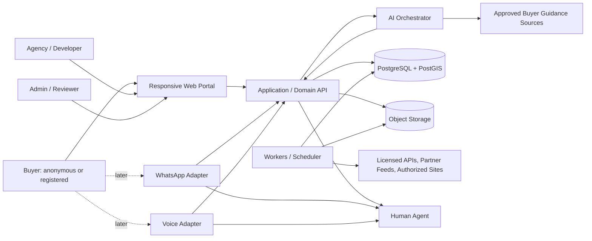
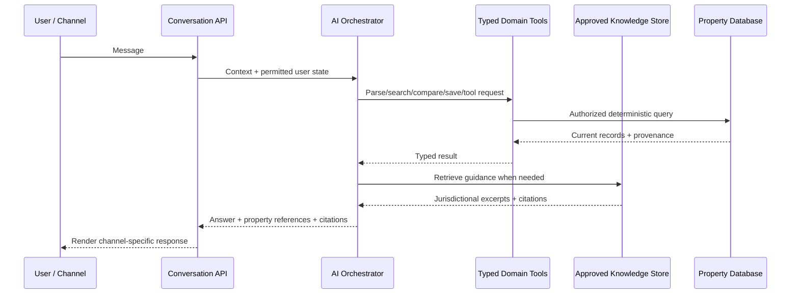

# Spain Property Buyer Portal — Complete Claude/Codex Specification v2
This merged document combines the modular build pack. The modular ZIP is preferable for repository use.


---

# Spain Property Buyer Portal — Claude/Codex Build Pack

Version: 2.0  
Prepared: 2026-08-04  
Status: Authoritative planning package for implementation

## Start here

For a coding agent, provide the repository together with this folder and instruct it to read the files in this order:

1. `01_PROJECT_SPEC.md` — product scope and requirements.
2. `02_ARCHITECTURE_AND_ROADMAP.md` — system design, phases, data model, APIs, security and acceptance criteria.
3. `03_PROPERTY_DATA_INGESTION.md` — live inventory, licensed feeds, authorized crawling, images, deduplication and freshness.
4. `04_MASTER_PROMPT_CLAUDE_CODEX.md` — ready-to-paste execution prompt.
5. `barcelona_property_explorer_legacy_60.json` — the 60-record legacy snapshot extracted from the attached static preview.

A merged version is also available as `spain_property_portal_complete_agent_spec_v2.md` outside this folder.

## Product decisions already made

- Public visitors can browse without signing in.
- Registration uses email OTP or mobile OTP.
- The MVP includes the multilingual website chat agent.
- WhatsApp and full voice are designed into the shared architecture from the beginning but activated in later phases.
- WhatsApp is the first commercial channel upgrade.
- Full telephone voice is added only after the portal and WhatsApp demonstrate real enquiry volume.
- All channels share one user identity, consent model, conversation history, search preferences, shortlists, leads and handoff workflow.
- Inventory must be obtained through direct agency/developer feeds, licensed APIs, partner CSV/XML/JSON, manual entry or explicitly authorized crawling.
- The product must not depend on unauthorized mass scraping, CAPTCHA bypass, access-control evasion or unlicensed image copying.
- The 60 existing records are legacy snapshot/demo data until freshness and media rights are verified.
- The first commercial milestone is one region, one dependable inventory source and one complete buyer journey.

## Suggested repository placement

```text
docs/product/PROJECT_SPEC.md
docs/architecture/ARCHITECTURE_AND_ROADMAP.md
docs/data/PROPERTY_DATA_INGESTION.md
docs/agent/MASTER_PROMPT_CLAUDE_CODEX.md
data/legacy/barcelona_property_explorer_legacy_60.json
```


---

# Spain Property Buyer Portal — Product Specification

Version: 2.0  
Authoritative status: This document defines the intended product. When implementation choices conflict with it, record the decision in `DECISIONS.md` and preserve the user-facing intent.

## 1. Product vision

Rebuild the static Barcelona Property Explorer as a production-grade, multilingual portal for buying property throughout Spain. The platform must combine current, rights-cleared property inventory with strong search, map intelligence, explainable comparisons, buyer education, document readiness and a source-grounded AI assistant.

The product should not compete only on listing volume. It should help a buyer answer:

1. Which properties genuinely fit my budget, household, lifestyle and travel needs?
2. Is the listing current, complete and trustworthy?
3. How does it compare with realistic alternatives?
4. What are the likely acquisition and recurring ownership costs?
5. Which documents and professional checks are normally required?
6. What should I do next: refine the search, ask the agency, arrange a viewing or consult a qualified professional?

## 2. Existing preview and migration status

The attached Barcelona Property Explorer preview is a compiled static frontend containing 60 property records embedded in JavaScript. It has useful card, table, filter and KPI concepts, but it is not an editable full-stack application.

The current preview does not contain:

- a source-code repository suitable for continued development;
- a backend or database;
- authentication;
- persistent favourites, shortlists, comparisons or history;
- property-image records;
- partner or administrator workflows;
- a live data-ingestion and freshness system;
- an AI service;
- a rights and provenance model;
- WhatsApp or voice integrations.

Import `barcelona_property_explorer_legacy_60.json` as legacy snapshot data. Preserve the original source URLs. Do not describe those records as live or verified until rechecked. Do not invent images.

## 3. Geographic scope

Initial commercial focus may be Catalonia, especially Barcelona, Girona, Lleida and Tarragona, while the data model must support all Spain from day one. Alcaraz is in Albacete province, Castilla-La Mancha, and must not be placed under Catalonia.

Use the hierarchy:

```text
Spain
└── Autonomous community
    └── Province
        └── Comarca or island, where applicable
            └── Municipality
                └── District
                    └── Neighborhood, locality or village
                        └── Postal code
                            └── Development, building or unit
```

Store official codes where available, multilingual names and historical or alternative names. Support exact and approximate coordinates, with an explicit accuracy level.

## 4. User groups

### 4.1 Buyers

- Spanish residents buying a home;
- foreign residents and non-resident buyers;
- families relocating within Spain;
- lifestyle, retirement and holiday-home buyers;
- investors;
- off-plan buyers;
- buyers comparing city, town, village, coastal, mountain and rural options;
- users requiring multilingual assistance.

### 4.2 Supply partners

- estate agencies;
- individual authorized agents;
- property developers;
- licensed data providers;
- professional partners such as lawyers, mortgage advisers, surveyors or relocation advisers, subject to future commercial policy.

### 4.3 Internal staff

- administrators;
- listing reviewers;
- partner onboarding staff;
- media-rights reviewers;
- legal-content reviewers;
- customer-support staff;
- AI-quality reviewers.

## 5. Core buyer journey

```text
Landing/search
  → browse cards/list/table/map
  → open property details
  → ask AI or refine search
  → favourite or add to named shortlist
  → compare alternatives
  → calculate estimated acquisition cost
  → ask questions or request documents
  → request viewing / contact agency
  → continue on website, email, WhatsApp or later voice
  → human handoff
```

Anonymous browsing must remain useful. Registration should unlock persistence rather than block discovery.

## 6. Authentication and identity

Support:

- email OTP;
- mobile SMS OTP;
- secure linking of verified email and mobile identities;
- optional passkeys and social login later;
- guest-session migration after successful verification;
- resend cooldowns, per-IP/per-identity limits, abuse detection and CAPTCHA escalation;
- session revocation and device/session management.

WhatsApp is not the initial authentication mechanism. WhatsApp identity can later be linked only after a deliberate verification and consent flow.

## 7. Anonymous experience

Anonymous users can:

- browse public inventory;
- search, filter and sort;
- use card, list, comparison-table and map views;
- open photo galleries and property pages;
- temporarily favourite and compare properties in local/session storage;
- use a rate-limited website AI chat;
- share property, search and comparison links;
- begin a viewing enquiry.

After registration, offer to merge eligible guest favourites, comparison items, recent views and AI search criteria.

## 8. Registered buyer workspace

Registered users can:

- maintain profile, language, currency and communication preferences;
- save multiple searches;
- receive opted-in alerts;
- maintain favourites and multiple named shortlists;
- add notes, labels and personal scores;
- mark stages such as researching, viewing requested, viewed, offer considered or rejected;
- compare properties side by side;
- invite trusted collaborators with view/comment permissions;
- maintain recently viewed properties and search history;
- continue AI conversations across supported channels;
- manage enquiries and viewing requests;
- export or delete personal data;
- control communication and profiling consent.

## 9. Property search and discovery

### 9.1 Geographic filters

- autonomous community;
- province;
- comarca, island or region;
- municipality;
- district;
- neighborhood, locality, village or postal code;
- radius search;
- map bounding box;
- draw-a-polygon search;
- commute-time search from one or more destinations.

### 9.2 Commercial and physical filters

- sale status;
- resale, new build, off-plan, renovation, land or commercial;
- property type;
- minimum/maximum price;
- estimated total acquisition cost;
- bedrooms and bathrooms;
- built, usable and plot area;
- price per square metre;
- condition;
- construction year and renovation year;
- floor, lift and accessibility;
- parking and storage;
- terrace, balcony, garden and pool;
- furnished state;
- orientation and natural light;
- heating, cooling, solar and EV charging;
- energy rating;
- occupancy status when lawfully provided;
- protected-housing or architectural-protection state when verified;
- last confirmed availability;
- source and agency/developer.

### 9.3 Lifestyle, terrain and surroundings

Support explicit source claims and platform-derived classifications separately:

- coastal;
- beachfront;
- near beach;
- sea view;
- river;
- lake or reservoir;
- mountain or mountain view;
- hill or hillside;
- valley;
- forest or natural park;
- rural or countryside;
- village;
- town;
- city centre;
- suburban;
- golf;
- marina;
- ski access;
- quiet area;
- family-oriented;
- walkable;
- nightlife;
- school, hospital, airport, transport and shopping accessibility.

Every non-obvious attribute must carry provenance: advertiser-declared, calculated, manually reviewed or document-verified.

### 9.4 Search result views

- responsive card grid with image, price, essential facts, freshness and source;
- compact list;
- sortable comparison table;
- interactive map with clustering and list synchronization;
- optional split-screen map/list layout;
- stable shareable URLs for search state;
- accessible non-map alternative.

KPI summaries should update with the query: matching count, median and average price, median €/m², typical commute and freshness indicators. Avoid presenting misleading averages for tiny samples.

## 10. Property detail page

Each page should support:

- rights-cleared responsive image gallery;
- image count, captions and attribution;
- floor plans, video and virtual tour when authorized;
- original listing text and clearly labelled translations;
- structured facts and features;
- price, price per square metre and observed price history;
- estimated acquisition-cost range with assumptions;
- optional mortgage scenarios labelled as estimates;
- known community fees, IBI and other recurring cost fields;
- energy rating and certificate-status field;
- address accuracy and map;
- verified nearby amenities and commute profiles;
- terrain and environmental context;
- accessibility information;
- source, agency, agent and developer identity;
- first seen, source updated, last checked and last confirmed available timestamps;
- listing quality and document-readiness indicators;
- explicit explanation of each verification badge;
- save, shortlist, compare, share, enquire, request viewing and ask-AI actions;
- alternatives with an explanation of why they are relevant;
- report-an-issue and stale-listing actions.

## 11. Favourites, shortlists and comparison

Allow users to create several named shortlists, for example “Barcelona family options,” “Tarragona coast,” or “Investment candidates.”

Comparison dimensions:

- location and administrative area;
- surroundings and terrain;
- verified amenity distances;
- public transport, driving, cycling and walking access;
- commute to user-defined destinations;
- price and €/m²;
- estimated acquisition cost;
- recurring known costs;
- floor area, bedrooms, bathrooms and outdoor area;
- condition and likely renovation risk;
- energy rating;
- accessibility;
- listing freshness;
- source and agency;
- document-readiness status;
- off-plan completion and evidence status;
- positive and negative features;
- personal notes and collaborator comments.

Users may assign weights to preferences. Produce an explainable suitability score, showing how it was calculated. Never present it as a valuation, legal opinion or guarantee.

## 12. Off-plan and new-development model

Model the development separately from units.

Development fields should include:

- developer and organization verification;
- location and master description;
- construction stage;
- announced and revised completion dates;
- licence/planning evidence status;
- buyer-funds protection or guarantee evidence status;
- common amenities;
- payment-plan templates;
- brochures, plans and authorized media;
- update history.

Unit fields should include:

- unit identifier;
- floor and orientation;
- bedrooms, bathrooms and areas;
- terrace/garden/parking/storage allocations;
- price and reservation amount;
- availability;
- payment schedule;
- floor plan;
- completion or handover estimate;
- changes over time.

Do not show a green “verified” badge merely because an agency supplied a field. Verification states must be specific and auditable.

## 13. Multilingual AI buyer assistant

### 13.1 Launch decision

The website text-chat assistant is part of the MVP and is a primary product differentiator. WhatsApp and full voice are not required for the first public release, but the conversation and tool architecture must be channel-neutral from day one.

### 13.2 Search mode

The assistant should:

- understand natural-language property requirements;
- separate mandatory constraints from preferences;
- ask only necessary questions;
- show its interpreted search criteria;
- call typed property-search tools;
- return only real, currently publishable inventory;
- explain matches and compromises;
- refine criteria conversationally;
- save a search or shortlist after user confirmation;
- never invent a property, price, location, feature or availability state.

Example:

> Find a quiet three-bedroom home under €500,000, within 50 minutes of Barcelona by train, near nature, with a terrace and low renovation risk.

### 13.3 Buyer-guidance mode

The assistant may provide educational guidance on:

- general purchase stages;
- identity/NIE concepts;
- reservation, deposit and contract stages;
- notary and Land Registry roles;
- mortgage preparation;
- new-build versus resale;
- regional taxes and cost estimates;
- common document checks;
- community-of-owners information;
- energy certificates;
- habitability and occupancy documentation;
- charges and encumbrance concepts;
- off-plan documents and safeguards;
- when to consult a lawyer, notary, tax adviser, architect, surveyor or mortgage professional.

Each legal/process answer must:

- identify the relevant country and region;
- retrieve from an approved knowledge base;
- cite the source and review date in the UI;
- distinguish official rule, common practice and estimate;
- state assumptions;
- contain an educational-information disclaimer;
- recommend a qualified professional for decisions;
- avoid definitive conclusions about a specific property without reviewed documents.

### 13.4 AI tools

The model must use typed internal tools such as:

```text
search_properties
get_property_details
get_property_freshness
compare_properties
find_similar_properties
get_price_history
get_location_context
calculate_estimated_purchase_cost
create_or_update_shortlist
save_property
save_search
request_viewing
create_lead
request_human_agent
get_general_buying_guidance
get_document_checklist
```

Do not give the model unrestricted SQL, arbitrary internet access or direct write access to user/account tables.

## 14. Omnichannel communication strategy

### 14.1 Principle

Design all channels from the beginning; launch them in phases.

```text
Day-one architecture: website chat + WhatsApp-ready + voice-ready
MVP activation: website chat
First commercial upgrade: WhatsApp Business
Later validated upgrade: web voice, then telephone voice
```

### 14.2 Shared conversation model

A conversation is not owned by a channel. It can contain messages from:

```text
web_chat
whatsapp
web_voice
phone_voice
email
human_agent
system
```

Persist:

- user or anonymous identity;
- channel-specific identity;
- conversation and thread;
- message direction, content type and language;
- referenced properties, searches and shortlists;
- consent and notification preferences;
- AI run metadata and tool calls;
- lead and viewing status;
- assigned human agent;
- summary and handoff notes;
- retention and deletion state.

### 14.3 Website chat — MVP

Support:

- multilingual text;
- property cards inside chat;
- criteria confirmation;
- compare/save/request-viewing actions;
- conversation history for signed-in users;
- anonymous limits;
- visible AI identity and limitations;
- human handoff.

### 14.4 WhatsApp — first commercial upgrade

Build the underlying adapter interface and consent tables from day one. Activate only after live inventory, lead operations and a valid WhatsApp Business setup exist.

Planned capabilities:

- text search and follow-ups;
- receive voice notes and location pins;
- return compact property cards with authorized image, price and deep link;
- save favourites and shortlists after identity linkage;
- book or request viewings;
- opted-in new-listing, price-drop and appointment notifications;
- continue a website conversation;
- request a human agent;
- message-template governance and opt-out processing.

Do not send unsolicited marketing messages. Separate transactional and marketing consent. Respect provider template and session rules.

### 14.5 Voice — later upgrade

Start with browser voice only after text chat is stable. Full telephone voice comes after demand is proven.

Planned capabilities:

- explicit AI disclosure;
- speech recognition and speech synthesis;
- live property search through the same tools;
- confirmation of important numbers and names;
- send selected properties through opted-in email/WhatsApp;
- viewing requests;
- transcript and summary;
- human transfer;
- recording consent and retention control;
- multilingual routing and fallback.

No cold calling. Outbound calls require explicit user request or legally valid consent. The system must never state that a viewing or availability is confirmed unless the responsible agency confirms it.

## 15. Alerts and notifications

Saved searches may trigger:

- new matching property;
- price reduction;
- back-on-market status;
- newly added media or documents;
- off-plan completion-date change;
- listing becoming stale, unavailable, reserved or sold;
- viewing request update.

Email is the MVP channel. SMS and WhatsApp require explicit opt-in, provider configuration, rate/cost limits and quiet-hour rules. Provide instant, daily and weekly modes where appropriate.

## 16. Partner portal

Partners should be able to:

- create and verify an organization;
- invite staff and assign roles;
- create, edit and withdraw listings;
- manage developments and units;
- upload authorized media;
- configure CSV/XML/JSON/API feeds;
- review validation and import errors;
- review duplicate suggestions;
- see freshness status;
- receive and manage leads;
- respond to enquiries and viewing requests;
- measure response time and lead outcomes;
- manage data/image-rights declarations.

## 17. Administrator portal

Role-based functions:

- listing and media review;
- stale, missing and contradictory listings;
- duplicate candidates;
- feed health and crawl health;
- source permissions and data licences;
- agency/developer verification;
- fraud and user reports;
- legal knowledge publication and review dates;
- calculator/tax-rule publication with effective dates;
- communication consent and template governance;
- privacy export/deletion requests;
- AI feedback and answer review;
- audit log inspection;
- user and partner support.

## 18. Trust, provenance and freshness

For important property facts, store:

- source and source listing ID;
- original source URL;
- extraction/import method;
- source-provided value;
- normalized value;
- confidence;
- verification type;
- first seen, last seen, source updated and last checked timestamps;
- history of material changes;
- responsible organization;
- media rights status.

Possible listing states:

```text
draft
pending_review
published
available
reserved
under_offer
sold
temporarily_unverified
stale
withdrawn
rejected
```

Do not infer “sold” merely because a page disappeared.

## 19. Buyer cost and document tools

Create a versioned rules engine rather than one hardcoded Spain percentage.

Possible inputs:

- autonomous community;
- resale/new build/off-plan;
- transaction date;
- price and applicable tax base;
- buyer circumstances only when relevant and voluntarily supplied;
- financing assumptions.

Store rule version and calculation timestamp. Show ranges, assumptions and a professional-review warning.

Document readiness may represent whether information has been supplied or reviewed for:

- seller/intermediary identity;
- economic conditions;
- usable and built area;
- energy certificate;
- habitability/occupancy documentation;
- age and reforms;
- community information and known charges;
- Land Registry identity and charges evidence;
- planning/protection status;
- accessibility;
- services and installations;
- off-plan licences, schedules and protection evidence.

The portal must not claim to prove legal title or compliance.

## 20. Localization and accessibility

Initial locales:

- English (`en`)
- Spanish (`es`)
- Catalan (`ca`)
- Arabic (`ar`), with proper RTL support

Store canonical source-language content separately from translations. Label machine translations. Do not overwrite original listing text.

Target WCAG 2.2 AA. Provide keyboard access, semantic controls, focus management, contrast, reduced motion, accessible tables, alternatives to map-only information and announcements for changing search results.

## 21. Privacy and consent

Because the platform stores identity, searches, history, shortlists, AI conversations, messages and leads, implement:

- purpose-based consent records;
- granular communication preferences;
- data minimization;
- role-based access;
- retention schedules by data type and channel;
- user export and deletion workflows;
- deletion propagation to derived AI data where feasible;
- restricted staff access to conversations;
- audit records for sensitive access;
- cookie/analytics consent;
- clear automated-ranking explanations;
- separate consent for call recording, WhatsApp marketing and optional profiling.

## 22. Non-goals for the first release

- nationwide coverage without dependable inventory;
- unlicensed copying of major portals;
- autonomous legal advice;
- binding valuations;
- automatic offer submission;
- mortgage approval decisions;
- full telephone voice operation;
- unsolicited WhatsApp campaigns;
- complex native mobile apps before responsive web validation.

## 23. Commercially sensible first milestone

Launch one excellent regional buyer journey with:

- one dependable agency/developer/API/feed source;
- rights-cleared images;
- fresh status and price history;
- multilingual search and web chat;
- favourites, shortlists, comparison and viewing request;
- admin and partner operations;
- measurable lead delivery.

Expand regions and channels only after proving that buyers engage and partners respond.


---

# Spain Property Buyer Portal — Architecture and Delivery Roadmap

Version: 2.0

## 1. Architecture principles

1. Build a modular monolith first, not an unnecessary microservice estate.
2. Keep domain boundaries clear so ingestion, AI and communication workers can scale independently later.
3. Use one canonical property database and one channel-neutral conversation model.
4. Separate a physical property from its commercial listings.
5. Store provenance, rights and freshness as first-class data.
6. Use typed interfaces for all external providers.
7. Protect user and partner data with database-level authorization.
8. Implement production paths as vertical slices, not disconnected screens.
9. Prefer deterministic rules and geospatial calculations over AI guesses.
10. Do not activate a channel until operational support, consent and monitoring exist.

## 2. Recommended stack

### 2.1 Core

- Monorepo: pnpm workspaces with Turborepo.
- Public/account/admin/partner web: Next.js App Router, React and TypeScript.
- Styling: Tailwind CSS and an accessible component library.
- Validation: Zod; React Hook Form for complex forms.
- Database: PostgreSQL with PostGIS.
- Managed platform: Supabase for PostgreSQL, Auth, Storage and optional Realtime.
- Migrations/queries: Drizzle ORM, unless the existing repository has a strong Prisma foundation. Use only one.
- Search MVP: PostgreSQL full-text search, unaccent, `pg_trgm` and PostGIS.
- Search scale adapter: Typesense/OpenSearch only when measurements justify it.
- Map: MapLibre GL JS with licensed tile/geocoding providers.
- Object storage: S3-compatible storage with CDN and signed uploads.
- Background jobs: one job framework, such as Trigger.dev, Inngest or a queue worker.
- AI orchestration: Python FastAPI or TypeScript service; choose based on team skill, but keep typed OpenAPI contracts.
- Retrieval: approved-source knowledge store using PostgreSQL/pgvector or equivalent.
- Observability: Sentry, OpenTelemetry-compatible traces, structured logs and provider-cost metrics.
- Testing: Vitest, React Testing Library, Playwright, database/RLS tests and AI evaluations.

### 2.2 Communication adapters

Define interfaces for:

- transactional email;
- SMS OTP and notifications;
- WhatsApp Business messaging;
- speech-to-text;
- text-to-speech;
- telephony;
- human-agent routing.

Do not hardwire domain logic into Twilio, Meta, Vonage or another vendor SDK. Vendor adapters must translate provider payloads into internal events.

## 3. Suggested monorepo

```text
apps/
  web/                    public portal, user account, admin and partner UI
  api/                    domain API/BFF if not fully hosted in Next.js
  ai-service/             orchestration, RAG, evaluations
  worker/                 ingestion, media, enrichment, alerts, freshness
packages/
  database/               schema, migrations, RLS, seeds
  domain/                 entities, policies, scoring, status machines
  search/                 typed search model and adapters
  ingestion/              source contracts, normalization, deduplication
  communications/         email/SMS/WhatsApp/voice interfaces and adapters
  ai-tools/               property and guidance tool contracts
  ui/                     shared design system
  i18n/                   dictionaries, locale routing and formatting
  observability/          logging, traces and metrics
  config/                 env validation, lint and TypeScript configs
data/
  legacy/
docs/
  architecture/
  product/
  data-sources/
  legal-content/
  operations/
  security/
```

## 4. Context diagram



## 5. Major bounded contexts

### Identity and consent

Users, guest sessions, verified email/mobile identities, channel identities, sessions, roles, communication preferences, consent, privacy exports and deletion.

### Geography

Spain hierarchy, aliases, coordinates, polygons, geocoding confidence, transport/amenity links and environmental layers.

### Inventory

Physical properties, developments, units, commercial listings, features, documents, media, prices, availability, provenance and verification.

### Search and ranking

Typed filters, geospatial queries, text search, saved searches, explainable preference weighting and result analytics.

### Buyer workspace

Favourites, named shortlists, comparison sets, notes, collaborators, history and purchase stages.

### Leads and viewings

Enquiries, viewing requests, assignments, messages, partner responses, statuses and service-level metrics.

### Conversations and channels

Channel-neutral threads, messages, participants, channel identities, AI runs, summaries, handoffs and notification delivery.

### Ingestion and data quality

Sources, permissions, feed configurations, jobs, raw snapshots, extracted values, normalization, media rights, duplicate candidates, freshness and audits.

### Knowledge and calculators

Approved documents, jurisdiction metadata, review dates, chunks, citations, regional tax/cost rules and document-readiness templates.

## 6. Core database model

Use UUID primary keys, created/updated timestamps and explicit audit data. Use soft deletion only where business/audit requirements justify it.

### 6.1 Identity and authorization

- `users`
- `user_profiles`
- `auth_identities`
- `guest_sessions`
- `user_channel_identities`
- `organizations`
- `organization_members`
- `organization_verifications`
- `roles`
- `permissions`
- `user_consents`
- `notification_preferences`
- `privacy_requests`
- `security_events`

### 6.2 Geography

- `countries`
- `autonomous_communities`
- `provinces`
- `comarcas`
- `municipalities`
- `districts`
- `neighborhoods`
- `postal_codes`
- `geo_aliases`
- `places`
- `amenities`
- `transport_stops`
- `environmental_layers`

Use PostGIS geometry/geography types and spatial indexes.

### 6.3 Inventory

- `physical_properties`
- `property_addresses`
- `property_locations`
- `property_listings`
- `listing_status_history`
- `listing_price_history`
- `property_types`
- `features`
- `property_features`
- `source_claims`
- `derived_attributes`
- `developments`
- `development_units`
- `offplan_milestones`
- `property_documents`
- `document_verifications`
- `media_assets`
- `media_rights`
- `listing_media`
- `property_provenance`
- `duplicate_candidates`
- `verification_events`

A physical property may have several listings. Never collapse source-specific prices or claims into one value without preserving provenance.

### 6.4 Buyer activity

- `favourites`
- `shortlists`
- `shortlist_items`
- `shortlist_collaborators`
- `property_notes`
- `comparison_sets`
- `comparison_items`
- `saved_searches`
- `search_runs`
- `recently_viewed`
- `user_preference_profiles`
- `alerts`
- `alert_deliveries`

### 6.5 Leads and conversations

- `leads`
- `lead_property_links`
- `viewing_requests`
- `lead_assignments`
- `lead_status_history`
- `conversations`
- `conversation_participants`
- `messages`
- `message_attachments`
- `message_property_links`
- `channel_threads`
- `agent_handoffs`
- `conversation_summaries`
- `ai_runs`
- `ai_tool_calls`
- `communication_deliveries`
- `call_sessions`
- `call_recordings`
- `call_consents`

Create call tables early but do not enable recording or telephony in the MVP.

### 6.6 Ingestion

- `data_sources`
- `source_permissions`
- `source_endpoints`
- `feed_configs`
- `crawler_configs`
- `ingestion_jobs`
- `ingestion_items`
- `raw_snapshots`
- `extraction_results`
- `normalization_events`
- `ingestion_errors`
- `feed_health_events`
- `source_takedown_requests`

### 6.7 Knowledge and rules

- `knowledge_sources`
- `knowledge_documents`
- `knowledge_versions`
- `knowledge_chunks`
- `knowledge_citations`
- `jurisdictions`
- `rule_sets`
- `rule_versions`
- `calculator_runs`
- `document_checklist_templates`
- `legal_content_reviews`
- `ai_feedback`
- `ai_evaluation_cases`
- `ai_evaluation_runs`

## 7. API design

Use versioned APIs and generated types. The exact transport can be REST, typed RPC or GraphQL, but public and provider boundaries should remain explicit.

### 7.1 Public search

```text
GET  /api/v1/geography/search
GET  /api/v1/properties
GET  /api/v1/properties/{listingId}
GET  /api/v1/properties/{listingId}/alternatives
GET  /api/v1/properties/{listingId}/price-history
GET  /api/v1/properties/{listingId}/freshness
POST /api/v1/search/parse-natural-language
POST /api/v1/compare/preview
```

### 7.2 Account/workspace

```text
GET/PUT /api/v1/me/profile
GET/POST/DELETE /api/v1/me/favourites
GET/POST/PUT/DELETE /api/v1/me/shortlists
POST /api/v1/me/shortlists/{id}/items
GET/POST/PUT/DELETE /api/v1/me/saved-searches
GET /api/v1/me/history
POST /api/v1/me/privacy/export
POST /api/v1/me/privacy/delete
```

### 7.3 Leads and AI

```text
POST /api/v1/leads
POST /api/v1/viewing-requests
GET  /api/v1/conversations
POST /api/v1/conversations
POST /api/v1/conversations/{id}/messages
POST /api/v1/ai/respond
POST /api/v1/ai/feedback
POST /api/v1/handoffs
```

### 7.4 Partners and admin

```text
POST /api/v1/partner/listings
PUT  /api/v1/partner/listings/{id}
POST /api/v1/partner/imports
GET  /api/v1/partner/imports/{id}
POST /api/v1/partner/media/uploads
GET  /api/v1/admin/review-queue
POST /api/v1/admin/listings/{id}/publish
POST /api/v1/admin/listings/{id}/withdraw
POST /api/v1/admin/duplicates/{id}/resolve
GET  /api/v1/admin/source-health
```

### 7.5 Provider webhooks

```text
POST /webhooks/auth/{provider}
POST /webhooks/email/{provider}
POST /webhooks/sms/{provider}
POST /webhooks/whatsapp/{provider}
POST /webhooks/telephony/{provider}
POST /webhooks/feeds/{partnerId}
```

Verify signatures, reject replay and store minimal raw payloads under retention rules.

## 8. Search model

Create a typed `PropertySearchCriteria` structure with:

- location selections and geometry;
- price and area ranges;
- property/deal types;
- numeric requirements;
- required features;
- preferred features with weights;
- commute destinations and modes;
- freshness requirement;
- exact versus approximate constraints;
- sort mode;
- locale and currency.

The AI only creates or modifies this type. A deterministic query builder executes it. Return explanations from the deterministic match/ranking layer wherever possible.

## 9. AI architecture



Requirements:

- separate system prompts for property search and buyer guidance;
- explicit tool schemas;
- allow-listed knowledge sources;
- prompt-injection isolation for retrieved text;
- no model-generated SQL;
- no write without user intent and authorization;
- property facts rendered from tool results, not model memory;
- per-user/IP rate limits and cost budgets;
- cached safe answers where appropriate;
- logging that avoids unnecessary personal data;
- evaluation tests for hallucination, citations, jurisdiction and escalation.

## 10. Channel-neutral messaging

Internal `Message` fields should include:

```text
id
conversation_id
participant_id
direction
channel
provider_message_id
content_type
text
structured_payload
language
property_links
attachment_ids
consent_basis
sent_at
delivered_at
read_at
failed_at
retention_class
```

Adapters map this to website components, WhatsApp templates/media, email and later voice/call events.

## 11. Security model

### 11.1 Threats

- OTP abuse and SMS pumping;
- account takeover;
- broken object-level authorization;
- partner impersonation;
- malicious media uploads;
- feed poisoning;
- stored XSS through descriptions;
- SQL/command injection;
- webhook spoofing and replay;
- privacy leakage through shared shortlists;
- scraping/enumeration of user data;
- spam leads;
- AI prompt injection;
- unauthorized model/tool actions;
- secret leakage;
- call-recording consent failures;
- WhatsApp consent/template violations.

### 11.2 Controls

- database Row Level Security and service-role isolation;
- least-privilege roles;
- signed uploads and content-type validation;
- malware-scanning workflow;
- image re-encoding;
- HTML sanitization;
- rate limits, quotas and abuse scoring;
- signature verification for provider webhooks;
- idempotency keys;
- Content Security Policy and secure headers;
- encryption in transit and at rest;
- secret manager and environment validation;
- dependency and container scanning;
- immutable audit logs for sensitive actions;
- backup and restore tests;
- data retention and deletion jobs;
- incident runbooks.

## 12. Delivery roadmap

### Phase 0 — Repository audit, data rights and product foundation

Deliver:

- inventory of attached/repository assets;
- `IMPLEMENTATION_PLAN.md`;
- `ARCHITECTURE.md` and diagrams;
- `DECISIONS.md`;
- data-source permission register;
- initial threat model;
- provider decision matrix;
- local development instructions.

Exit criteria: scope and source rights are clear enough to build one vertical slice.

### Phase 1 — Platform foundation

Deliver:

- monorepo, CI, lint, type checks and tests;
- database, PostGIS, migrations and RLS;
- geography seed/import;
- email and mobile OTP;
- guest sessions and account migration;
- roles and organization model;
- storage and media foundations;
- i18n including Arabic RTL;
- observability.

### Phase 2 — Public inventory and search

Deliver:

- normalized property/listing schema;
- legacy 60-record importer;
- manual listing workflow;
- list/card/table/map search;
- geography, lifestyle and core property filters;
- property details with provenance/freshness;
- rights-cleared image gallery;
- responsive, accessible UI.

### Phase 3 — Buyer workspace

Deliver:

- favourites;
- named shortlists and notes;
- comparison sets and explainable scoring;
- recently viewed and search history;
- saved searches;
- email alerts;
- enquiries and viewing requests.

### Phase 4 — Live inventory operations

Deliver:

- partner onboarding;
- CSV import with field mapping;
- XML/JSON feed framework;
- one real permitted source end to end;
- raw snapshots and audit;
- image-rights tracking;
- freshness and missing-listing logic;
- price history;
- duplicate candidates;
- partner and admin dashboards.

### Phase 5 — Website AI chat MVP

Deliver:

- chat UI and conversation persistence;
- typed natural-language search;
- property cards and compare/save actions;
- approved-source buyer guidance;
- citations, jurisdiction and disclaimers;
- human handoff;
- rate/cost limits;
- AI evaluation suite.

### Phase 6 — Buyer intelligence

Deliver:

- regional acquisition-cost rules engine;
- document-readiness checklist;
- commute profiles;
- amenity and terrain derivation;
- selected authoritative risk overlays;
- off-plan development/unit workflows;
- collaborative shortlists and export.

### Phase 7 — WhatsApp commercial upgrade

Prerequisites:

- dependable inventory;
- lead response operation;
- approved business account and templates;
- clear consent and opt-out process;
- cost controls and monitoring.

Deliver:

- inbound webhook adapter;
- identity-linking flow;
- text, location and authorized image/property-card support;
- optional voice-note transcription;
- viewing and human-handoff actions;
- transactional alerts and opted-in marketing separation;
- conversation continuity with website;
- delivery/read/failure status handling.

### Phase 8 — Voice upgrade

First add optional browser voice input/output; then telephony after demand validation.

Deliver:

- speech adapters;
- explicit AI/recording disclosure;
- numeric confirmation and error recovery;
- phone call sessions;
- human transfer;
- transcript, summary and lead attachment;
- send selected properties through permitted channels;
- recording retention and deletion;
- multilingual quality tests.

### Phase 9 — Scale and expansion

- additional regions and partners;
- stronger search service only if needed;
- mobile app only if usage supports it;
- performance and load testing;
- disaster recovery;
- partner billing/lead plans;
- advanced analytics and experimentation.

## 13. MVP acceptance criteria

The MVP is accepted only when:

- anonymous users can browse legitimate inventory with authorized images;
- list, card, table and map views work responsively;
- location and lifestyle filters work;
- property pages show source, rights, freshness and energy-state fields;
- email and phone OTP pass e2e and abuse tests;
- registered users can favourite, shortlist, compare, note, save searches and review history;
- email alerts are produced by background jobs;
- admin can create, review, publish, update and withdraw listings;
- at least one permitted live import path works end to end;
- stale/missing listings and price changes are handled;
- English, Spanish, Catalan and Arabic work, including RTL;
- website AI chat returns only database properties and provides grounded guidance;
- privacy export and deletion workflows exist;
- critical security, accessibility, data-quality and browser tests pass;
- deployment, monitoring, backups and restore are documented.

WhatsApp and telephone voice are not MVP acceptance requirements, but their shared data contracts, consent model and adapter interfaces must exist.

## 14. Engineering working method

- Inspect before modifying.
- Maintain `IMPLEMENTATION_PLAN.md`, `DECISIONS.md` and a current architecture diagram.
- Build one complete vertical slice at a time.
- Use database migrations; never edit production schema manually.
- Add tests with each slice.
- Run format, lint, type, migration, unit, integration and e2e checks.
- Record assumptions instead of repeatedly stopping for minor reversible decisions.
- Stop for missing credentials, missing source permission or an irreversible legal/business decision.
- When a provider is unavailable, create a typed adapter, test fake and setup guide; do not pretend it is integrated.
- Never mark a feature complete while critical tests fail.


---

# Spain Property Buyer Portal — Property Data Ingestion, Crawling and Freshness Specification

Version: 2.0  
Purpose: Define how for-sale property inventory is legally, technically and operationally acquired, normalized, published and kept current.

## 1. Core policy

The platform must not depend on indiscriminate scraping of Spanish property portals. Use this priority:

1. Direct agency and developer API/webhook.
2. Licensed portal or data-provider API.
3. Agency CRM XML/JSON feed.
4. Partner CSV upload.
5. Manual partner/editor entry.
6. Explicitly authorized crawling of a partner-controlled website.
7. Official/open geospatial enrichment.

Unauthorized mass scraping, CAPTCHA bypass, login/access-control evasion, proxy rotation intended to defeat blocking and unlicensed copying of images or descriptions are prohibited.

`robots.txt` is a crawler instruction, not a republication licence. Every source also needs recorded contractual/permission status and media rights.

## 2. Source registry

No automated source runs until it is registered.

Minimum fields:

```text
source_id
organization_id
source_name
domain
source_type: api | webhook | xml | json | csv | manual | authorized_crawl
permission_status: pending | approved | restricted | suspended | expired
permission_document_reference
permitted_paths_or_endpoints
allowed_fields
image_rights: none | hotlink_only | display | download_and_transform
attribution_requirements
update_frequency
rate_limit
robots_reviewed_at
terms_reviewed_at
legal/commercial contact
technical contact
retention restrictions
takedown procedure
active_from / active_until
```

The source manager must prevent jobs when approval is missing, expired or suspended.

## 3. Source-adapter contract

All adapters must output a common source record without directly publishing it.

```typescript
interface SourcePropertyRecord {
  sourceId: string;
  externalListingId: string;
  sourceUrl: string;
  sourceCreatedAt?: string;
  sourceUpdatedAt?: string;
  fetchedAt: string;
  status?: string;
  transactionType: 'sale' | 'unknown';
  propertyType?: string;
  title?: LocalizedText;
  description?: LocalizedText;
  price?: Money;
  bedrooms?: number;
  bathrooms?: number;
  builtAreaM2?: number;
  usableAreaM2?: number;
  plotAreaM2?: number;
  address?: SourceAddress;
  coordinates?: Coordinates;
  features?: SourceFeature[];
  energy?: SourceEnergyData;
  recurringCosts?: SourceRecurringCosts;
  offPlan?: SourceOffPlanData;
  media?: SourceMedia[];
  agent?: SourceAgent;
  rawSnapshotId: string;
}
```

Adapters must be idempotent. A re-run with unchanged input must not create duplicate listings or histories.

## 4. Ingestion pipeline

```mermaid
flowchart LR
    S[Permitted source]
    F[Fetch / receive webhook]
    R[Immutable raw snapshot]
    E[Extract]
    V[Validate]
    N[Normalize]
    G[Geocode and enrich]
    M[Media rights and processing]
    D[Duplicate matching]
    Q[Quality / moderation]
    P[Publish or update]
    H[Freshness and history]

    S --> F --> R --> E --> V --> N --> G --> M --> D --> Q --> P --> H
```



### 4.1 Fetch

- obey source schedule and rate limits;
- identify the crawler clearly where appropriate;
- use conditional requests (`ETag`, `If-Modified-Since`) when supported;
- use retries with exponential backoff;
- distinguish source errors from “listing missing”;
- record HTTP/provider status and latency;
- never treat a blocked/failed fetch as evidence that a property was sold.

### 4.2 Raw snapshot

Store a content hash and immutable raw response or provider payload where permitted:

- source and endpoint;
- fetch timestamp;
- response status and headers needed for audit;
- content type;
- content hash;
- raw object location;
- parser/extractor version;
- permission version;
- job ID.

Apply retention and access restrictions. Raw HTML or API payloads may contain unnecessary personal data; minimize and protect them.

### 4.3 Extraction

Extraction priority for authorized sites:

1. official API/feed payload;
2. JSON-LD or structured data;
3. embedded page-state JSON;
4. stable semantic HTML;
5. browser-rendered DOM only when necessary.

Create a source-specific adapter rather than one fragile universal selector. Add fixture-based parser tests using permitted saved pages.

### 4.4 Validation

Validate types, ranges and mandatory fields. Examples:

- sale price must be positive and currency known;
- bedrooms/bathrooms cannot be negative;
- coordinates must be within plausible bounds;
- image URLs must use approved domains or signed provider URLs;
- source ID and external listing ID are mandatory;
- status must map to a controlled vocabulary;
- an advertised energy rating and certificate status are distinct fields.

Invalid records go to a review/error queue; they do not silently publish.

### 4.5 Normalization

Map source variants to canonical values while preserving the source claim.

Examples:

```text
piso, appartement, apartment → apartment
ático → penthouse
chalet independiente → detached_house
casa de pueblo → village_house
obra nueva → new_build
sobre plano → off_plan
3 hab., 3 dormitorios → bedrooms = 3
```

Store:

- source value;
- canonical value;
- mapping rule/version;
- confidence;
- whether a human overrode it.

### 4.6 Geography and enrichment

- match official geographic entities;
- geocode only under provider rights;
- store exact/approximate accuracy;
- derive distance to coastline, beach, river, station, airport, hospital and selected amenities;
- calculate terrain/elevation classifications from licensed/open data;
- preserve advertiser claims separately;
- never publish an exact private location when the partner supplies only an approximate point.

## 5. Authorized crawling workflow

### 5.1 Prerequisites

For a partner website without a feed:

- written authorization from the controlling organization;
- allowed path and schedule;
- confirmation of description and image rights;
- attribution rules;
- contact for selector/layout changes;
- agreed takedown and termination process.

### 5.2 Discovery

Discover listing URLs from permitted:

- XML sitemaps;
- “for sale” category pages;
- pagination;
- internal search endpoints explicitly allowed;
- change feeds.

Normalize URLs and maintain a discovery set. Do not crawl unrelated site sections.

### 5.3 Detail extraction

Extract only agreed fields. For JavaScript-heavy pages, prefer underlying public JSON used by the authorized partner page if permission covers it. Use Playwright only when server-rendered/structured options are unavailable.

### 5.4 Crawl scheduling

A reasonable starting policy:

- discovery: one or two times daily;
- active listing details: daily;
- high-interest or recently changed listings: more frequently only if agreed;
- inactive listings: verification job before withdrawal;
- source backoff during errors.

Schedules must be configurable per source.

## 6. Feed and API synchronization

### 6.1 Full feeds

When a complete feed represents all active inventory:

```text
new external ID       → create pending/published listing
existing changed ID   → update and add material histories
existing unchanged ID → update last-seen only
previous ID missing   → mark temporarily unverified, then confirm withdrawal
```

Never remove a record permanently on the first missing run. Distinguish a successful complete feed from a partial/failed feed.

### 6.2 Incremental feeds/webhooks

- verify webhook signature;
- require idempotency/provider event ID;
- store event receipt and processing status;
- reconcile periodically with a complete feed/API scan;
- handle out-of-order events using source timestamps and version numbers.

## 7. Images and media rights

Images may be published only when permission explicitly covers the intended use.

For each media asset store:

```text
source media ID
source listing ID
original URL or upload reference
rights owner
rights basis and permission version
allowed transformations
attribution
first and last verified timestamps
content hash
perceptual hash
width/height/type
storage variants
status: pending | approved | blocked | expired | removed
```

Processing steps:

1. Validate source and permission.
2. Download/upload through a controlled worker.
3. Enforce size and type limits.
4. Scan for malicious content.
5. Decode and re-encode images.
6. Strip unnecessary metadata.
7. Calculate cryptographic and perceptual hashes.
8. Generate thumbnail/card/detail variants.
9. Store caption, attribution and display order.
10. Detect duplicates, watermarks and placeholders for review.

Do not hotlink by default. Hotlink only when the agreement requires/allows it and privacy/performance implications are accepted. Do not invent or AI-generate property photos as listing evidence.

## 8. Physical-property and listing separation

Data model:

```text
Physical property
  ├── Listing from Agency A at €495,000
  ├── Listing from Agency B at €500,000
  └── Historical/withdrawn listing
```

The physical property stores durable characteristics when confidence is sufficient. Each listing stores source-specific commercial claims, price, description, status, media, agent and URL.

The UI may indicate possible multiple advertisements but must not hide material conflicts.

## 9. Duplicate detection

Generate candidates using a weighted combination of:

- normalized address;
- coordinate distance and location accuracy;
- built/usable/plot area tolerance;
- bedrooms, bathrooms, floor and unit identifiers;
- development/building;
- agency reference;
- description similarity;
- image perceptual-hash overlap;
- price and publication dates;
- cadastral reference only when lawfully obtained and appropriately protected.

Use confidence bands:

```text
high confidence   → auto-link only under approved deterministic rules
medium confidence → human review
low confidence    → retain separately
```

Never merge merely because titles are similar.

## 10. Freshness and listing lifecycle

Store:

```text
source_created_at
source_updated_at
first_seen_at
last_seen_at
last_content_change_at
last_checked_at
last_confirmed_available_at
missing_since
reserved_at
sold_at
withdrawn_at
```

Canonical operational states:

- available;
- reserved;
- under offer;
- sold;
- temporarily unverified;
- stale;
- withdrawn;
- rejected.

Example missing logic:

```text
First missing occurrence after a successful complete sync
  → temporarily_unverified

Still missing after configured confirmation checks
  → withdrawn/unavailable

Explicit partner sold event
  → sold
```

Show users meaningful timestamps, e.g. “Last confirmed available 4 August 2026.”

## 11. Price and material-change history

Create append-only histories for:

- asking price;
- listing status;
- completion date;
- bedrooms/area when materially corrected;
- source identity;
- recurring charges;
- significant document/verification state.

A price event stores old/new values, effective/source timestamp, observed timestamp, source and change reason where known.

## 12. Publication quality gate

A listing can be automatically published only when source policy allows it and minimum checks pass:

- active source permission;
- stable external ID;
- valid sale price;
- valid geographic placement;
- property type;
- minimum description/fact completeness;
- authorized primary image, unless text-only publication is explicitly allowed;
- no high-confidence fraud or duplicate conflict;
- acceptable freshness;
- required attribution;
- partner organization status.

Otherwise send it to moderation with clear reasons.

## 13. Data provenance model

Every important field should be explainable.

```text
fact key
source claim
normalized value
derived value, if any
source ID and URL
method: api | feed | crawl | manual | calculation | document review
confidence
verified by / verified at
rule or extractor version
```

Examples shown in UI:

- “Sea proximity calculated from map data.”
- “Energy rating supplied by advertiser; certificate not reviewed.”
- “Completion date supplied by developer and last updated on …”

## 14. Monitoring and operations

Dashboards and alerts:

- source success/failure rate;
- records discovered, created, updated, missing and rejected;
- parser error rate by field;
- layout/selectors changed;
- feed delay and staleness;
- image failure and rights expiry;
- duplicate queue size;
- publication backlog;
- provider rate-limit and cost usage;
- user stale-listing reports.

Provide replay from raw snapshot, dry-run imports, field mapping preview, canary runs and rollback of a bad import batch.

## 15. Security controls

- isolate fetch workers from application credentials;
- restrict outbound network destinations to registered sources where practical;
- prevent SSRF in supplied feed/image URLs;
- validate archives and XML securely; disable external entities;
- limit decompressed size and record count;
- sanitize descriptions;
- scan and re-encode media;
- verify webhooks;
- protect raw snapshots and personal agent data;
- log permission and publication changes;
- enforce per-source quotas.

## 16. First implementation slice

Implement this exact sequence:

1. Source registry and permission model.
2. Manual listing and rights-cleared media upload.
3. Legacy 60-record importer marked `legacy_snapshot`.
4. Generic CSV importer with mapping preview and dry run.
5. XML/JSON adapter interface and fixture tests.
6. One real partner feed or authorized site adapter.
7. Raw snapshot storage and idempotent upsert.
8. normalization and geography matching.
9. image processing and rights records.
10. price/status history.
11. missing/stale workflow.
12. duplicate-candidate engine.
13. source-health and moderation dashboards.

## 17. Acceptance tests

- reimporting identical source data creates no duplicates or fake histories;
- a changed price creates exactly one price event;
- a failed feed does not withdraw all listings;
- a property missing from one successful full sync enters temporary verification first;
- expired source permission prevents new publication;
- unauthorized images are blocked;
- a malicious image/XML fixture is rejected;
- exact and approximate coordinates obey display policy;
- duplicate candidates preserve separate source listings;
- raw snapshots can be replayed with a newer parser;
- every public listing exposes source and freshness;
- legacy records are visibly marked as snapshots until verified.


---

# Master Prompt for Claude Code / Codex

Copy the prompt below into Claude Code, Codex or another capable repository coding agent. Give it access to the repository and all files in this build pack.

---

You are the principal product engineer, system architect and implementation lead for a production-grade multilingual Spain Property Buyer Portal.

Read these files in full before changing code:

1. `01_PROJECT_SPEC.md`
2. `02_ARCHITECTURE_AND_ROADMAP.md`
3. `03_PROPERTY_DATA_INGESTION.md`
4. `barcelona_property_explorer_legacy_60.json`

Treat them as the authoritative product specification. Inspect the complete repository, including the existing static Barcelona Property Explorer preview, package manifests, deployment files, environment examples and tests. Do not assume the compiled preview is a maintainable source project.

## Mission

Build a secure, scalable but lean full-stack property-buying portal for Spain. Anonymous visitors must be able to browse. Users can register through email OTP or mobile OTP, save history/favourites/shortlists, compare properties and use a multilingual AI assistant. The product must support rights-cleared property images, location/lifestyle filters, off-plan inventory, live-source freshness and a partner/admin operating model.

The MVP must include the website text-chat AI assistant. WhatsApp and voice must be represented in the day-one domain model and typed adapter interfaces, but actual WhatsApp activation is a later commercial phase and full telephone voice is a later validated phase. Do not delay the MVP by implementing complete telephony.

All future channels must share one conversation, user identity, consent, search, shortlist, lead, viewing and human-handoff system.

Inventory must be obtained by direct agency/developer sources, licensed APIs, partner feeds/uploads, manual entry or explicitly authorized crawling. Never implement mass unauthorized scraping, CAPTCHA bypass, access-control evasion or unlicensed image copying.

## Required first output — before implementation

Create or update:

- `IMPLEMENTATION_PLAN.md`: vertical slices, dependencies, risks, estimates expressed as relative complexity rather than promises, and acceptance tests.
- `ARCHITECTURE.md`: context, containers, components, data flows, Mermaid diagrams and provider boundaries.
- `DECISIONS.md`: dated ADR-style decisions and assumptions.
- `THREAT_MODEL.md`: identities, assets, trust boundaries, abuse cases and controls.
- `DATA_SOURCE_REGISTER.md`: initially empty/placeholder register with permission fields; mark the legacy 60 records as snapshot/demo data.
- `.env.example`: typed, documented variables with no secrets.

Summarize the repository audit and identify missing credentials or source permissions. Continue with reversible engineering decisions without repeatedly asking for approval. Stop only for an irreversible business/legal choice, missing permission to use property data/images, or credentials that are truly necessary to test an external production provider.

## Implementation strategy

Build complete vertical slices in this order:

### Slice 1 — Foundation

- monorepo/workspace and reproducible local setup;
- Next.js + TypeScript frontend;
- PostgreSQL/PostGIS schema and migrations;
- database Row Level Security or equivalent authorization tests;
- email/mobile OTP with local/test adapters;
- guest sessions and guest-to-account merge;
- locale routing for English, Spanish, Catalan and Arabic with RTL;
- logging, error reporting and health endpoints;
- CI for format, lint, typecheck, migrations and tests.

### Slice 2 — Geography and inventory

- nationwide geographic hierarchy;
- physical-property/listing separation;
- developments and units;
- source, provenance, permission, freshness, price/status history and media-rights tables;
- deterministic importer for `barcelona_property_explorer_legacy_60.json`;
- mark imported records `legacy_snapshot`, preserve URLs and do not invent images;
- manual listing and authorized media upload.

### Slice 3 — Public buyer experience

- responsive card, list, table and map views;
- URL-backed filters for geography, price, beds, area, property type and lifestyle classifications;
- synchronized map/list and accessible map alternative;
- property detail page with gallery, source, freshness, price history and verification explanations;
- dark/light mode and mobile support inspired by the original preview;
- SEO metadata, canonical/localized routes and structured data where appropriate.

### Slice 4 — Buyer workspace

- favourites;
- multiple named shortlists;
- notes and purchase stages;
- comparison sets with explainable weighted scoring;
- recent views and search history;
- saved searches and email alerts;
- leads and viewing requests;
- privacy export and deletion.

### Slice 5 — Live data operations

Implement the source registry and ingestion specification:

- CSV mapping/import preview and dry run;
- XML/JSON adapter framework;
- API/webhook interfaces;
- explicitly authorized crawler adapter framework;
- raw snapshots;
- validation and normalization;
- geography matching and derived attributes;
- rights-aware image pipeline;
- idempotent upsert;
- price/status/material histories;
- missing/stale state machine;
- duplicate candidates;
- moderation and source-health dashboards.

Do not create an extractor for a third-party portal unless the repository contains documented authorization for that exact source and media use.

### Slice 6 — Website AI assistant

Create a channel-neutral conversation domain and website chat UI.

The model must use typed tools. It must not receive unrestricted database or SQL access. Implement at least:

- `search_properties`
- `get_property_details`
- `compare_properties`
- `find_similar_properties`
- `get_price_history`
- `get_location_context`
- `calculate_estimated_purchase_cost`
- `save_property`
- `create_or_update_shortlist`
- `save_search`
- `request_viewing`
- `create_lead`
- `request_human_agent`
- `get_general_buying_guidance`
- `get_document_checklist`

Search mode must convert natural language into a validated typed query, distinguish hard constraints from preferences, show interpreted criteria and return only real published listings.

Buyer-guidance mode must retrieve only approved sources; include jurisdiction, source/review date, assumptions and a disclaimer; distinguish rules, common practice and estimates; and escalate specific legal, tax, mortgage, planning or structural decisions to qualified professionals.

Persist conversations for registered users. Apply restricted retention to anonymous sessions. Add rate limits, token/cost budgets, prompt-injection protections, source allow-listing, PII minimization and an evaluation suite covering hallucinated property facts, citations, jurisdiction and safe escalation.

### Slice 7 — Omnichannel foundations

Implement now:

- channel-neutral conversations/messages/participants;
- channel identity links;
- communication consent and preferences;
- delivery records;
- agent handoffs and summaries;
- typed adapter contracts for email, SMS, WhatsApp, speech and telephony;
- provider fakes for tests;
- webhook signature/idempotency framework.

Do not claim WhatsApp or telephone voice is operational unless real provider configuration and end-to-end tests exist.

### Slice 8 — Buyer intelligence

- versioned regional acquisition-cost rule engine;
- document-readiness templates;
- amenity/commute and terrain derivation;
- selected authoritative risk layers;
- off-plan evidence and milestone tracking;
- collaborative shortlists and exports.

### Later activation — WhatsApp

Only after prerequisites are satisfied, implement the configured WhatsApp Business provider:

- inbound text, location and media/voice-note events;
- identity-linking flow;
- property cards with authorized image and deep link;
- save, compare, viewing and handoff actions;
- opted-in alerts;
- template/session/opt-out governance;
- website conversation continuity;
- delivery/read/failure handling.

### Later activation — Voice

First support optional browser speech input/output. Add telephony only after demand is proven:

- explicit AI and recording disclosure;
- speech adapters and latency/error handling;
- confirmation of prices, dates, phone numbers and addresses;
- same property and guidance tools;
- human transfer;
- transcript/summary and lead attachment;
- recording consent, retention and deletion;
- no cold calling.

## Engineering constraints

- Prefer a modular monolith with clear packages over premature microservices.
- Use one ORM/migration system and one background-job framework.
- Use PostGIS for geographic queries.
- Treat source claims, normalized values, calculated attributes and document verification as different provenance types.
- Keep exact/approximate location policy explicit.
- Never infer “sold” from one missing page or a failed source run.
- Never publish an image without a recorded rights basis.
- Sanitize all partner descriptions and re-encode images.
- Protect feed fetching against SSRF, XML external entities, decompression bombs and malicious files.
- Implement webhook signature and replay protection.
- Do not hardcode one nationwide tax percentage; use versioned jurisdictional rules.
- Do not overwrite original listing language with machine translations.
- Meet WCAG 2.2 AA as the accessibility target.
- Keep all secrets outside source control.
- Do not state that a vendor integration exists when only an interface/fake exists.

## Testing expectations

Every slice requires relevant:

- unit tests;
- schema/migration tests;
- authorization/RLS tests;
- API integration tests;
- browser end-to-end tests;
- accessibility checks;
- data-quality and importer fixture tests;
- security/abuse tests;
- AI evaluation tests.

Critical required cases:

- guest data merges correctly after OTP;
- one user cannot access another user’s shortlists/conversations;
- identical reimport is idempotent;
- changed price creates one history event;
- failed feed does not withdraw inventory;
- expired permission blocks publication;
- unauthorized images are rejected;
- approximate locations are not exposed as exact;
- AI returns no listing absent from the tool result;
- AI legal guidance has jurisdiction, citation/review date, disclaimer and escalation;
- provider webhook replays are rejected;
- Arabic RTL and core flows pass browser tests.

## Definition of done

A feature is done only when:

- implementation, migrations and authorization are present;
- loading, empty, error and permission states exist;
- monitoring/logging is adequate;
- tests pass;
- user-facing copy is localized or has an explicit fallback;
- documentation and environment variables are updated;
- no critical TODO or mock is presented as production functionality.

## Working behaviour

Maintain `IMPLEMENTATION_PLAN.md` and mark completed acceptance criteria. Keep `DECISIONS.md` current. Make coherent change sets. After every major slice run formatting, linting, type checks, migrations and tests. Fix failures before claiming completion.

Prefer one working end-to-end journey over many static screens. Preserve the strongest aspects of the original dark dashboard while making trust, provenance, images, accessibility and mobile usability first-class.

Begin now with repository inspection and the required planning documents, then implement the first vertical slice. Do not wait for repeated approval on minor reversible decisions.

---
